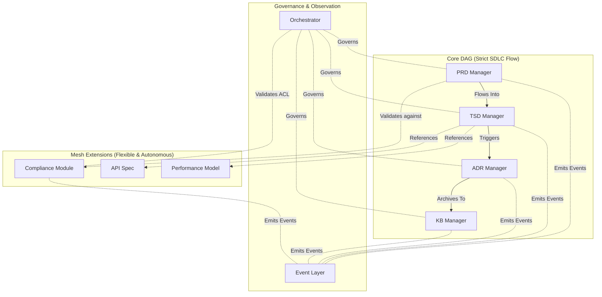

# SDLC_IDE: A Multi-Agent System for Software Development Lifecycle Management

## Table of Contents

1.  [Overview](#1-overview)
2.  [Architecture](#2-architecture)
3.  [Key Principles](#3-key-principles)
4.  [Governance](#4-governance)
5.  [Getting Started](#5-getting-started)
6.  [Contributing](#6-contributing)

## 1. Overview

SDLC_IDE is a multi-agent system designed to manage all document artifacts throughout the software development lifecycle. It provides a robust and flexible framework for defining, managing, and governing the relationships between different documents, ensuring a deterministic and auditable development process.

The system is built on a **Hybrid Directed Graph Architecture** that combines a strict, core workflow with flexible, agent-driven extensions. This allows for both strong governance and adaptability, making it suitable for a wide range of development methodologies.

## 2. Architecture

The architecture of SDLC_IDE is defined in detail in our **Architecture Decision Records (ADRs)**. The foundational architecture is established in [ADR-001: Hybrid Directed Graph Architecture](docs/architecture/design/adr-001-hybrid-dag-mesh-ext.md).

It is composed of three main components:

*   **Core Directed Acyclic Graph (DAG):** Defines the strict, deterministic workflow for core SDLC documents. This graph manages the transition between primary artifacts like the **Product Requirements Document (PRD)**, **Technical Specification Document (TSD)**, and **Architecture Decision Records (ADRs)**.
*   **Selective Mesh Extension Layer:** Allows for the integration of user-defined document types and relationships. This layer is designed for dynamic, autonomous extensions, as described in [ADR-010: Autonomous Mesh Extension Architecture](docs/architecture/design/adr-010-autonomous-mesh-extensions.md).
*   **Event-Based Observer Layer:** Captures and analyzes all status and relationship events throughout the system. This layer provides crucial insights and enables AI-driven assistance.

## 3. Key Principles

The SDLC_IDE project is guided by a set of key architectural principles that ensure a clear separation of concerns and a robust, scalable system.

*   **Human-Governed Core:** The Core DAG is considered immutable to autonomous agents. Any modifications to the core flow require explicit human approval via the ADR governance process.
*   **Agent-Driven Extensibility:** The Mesh Extension Layer is designed for dynamic, autonomous extensions. Agents can propose and manage their own document types and relationships within this layer, following the process outlined in ADR-010.
*   **Single Source of Authority (SSoA):** The Core DAG serves as the single source of truth for the SDLC lifecycle. The Mesh can enrich and extend the core, but it can never override its fundamental structure.
*   **Separation of Concerns:** The architecture enforces a strict separation between the Core DAG (structure) and the Event Layer (behavior), ensuring that the system's state is always verifiable and auditable.

## 4. Governance

The SDLC_IDE project uses a governance model based on the **Open Policy Agent (OPA)** to enforce architectural constraints and ensure that all changes to the system are made in a controlled and deliberate manner.

### Architecture Decision Records (ADRs)

All significant architectural decisions are documented in **Architecture Decision Records (ADRs)**, which are stored in the `docs/architecture/design` directory. ADRs are the single source of truth for all architectural decisions.

## 5. Getting Started

This section will be updated as the project progresses.

## 6. Contributing

We welcome contributions to the SDLC_IDE project. For any significant architectural changes, you must submit an ADR. For all code contributions, please submit a pull request.
