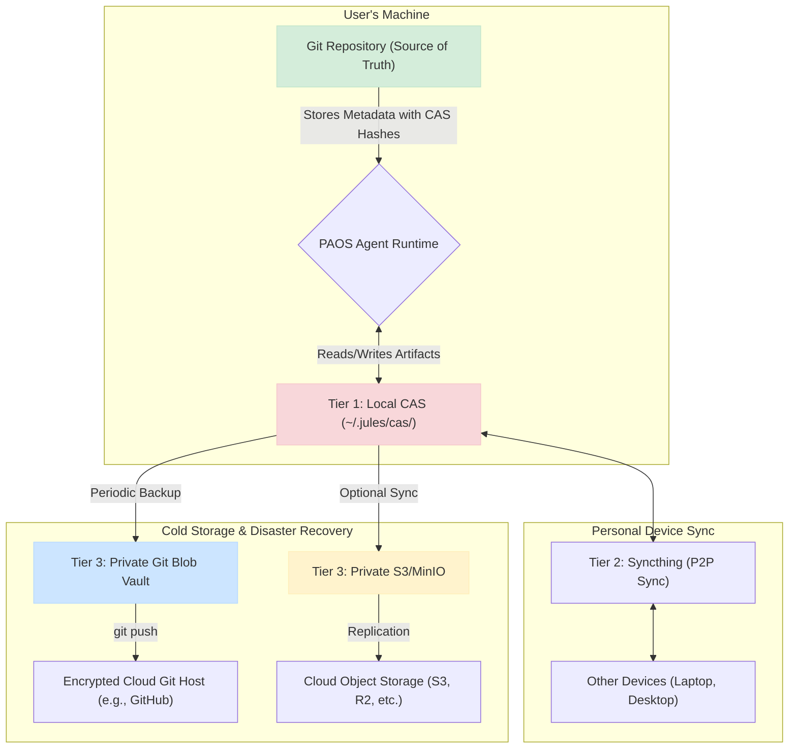

# ADR-PAOS-004: Content-Addressed Storage for Generated Artifacts

- **Status**: Proposed
- **Date**: 2025-11-28
- **Deciders**: Yumin Chen

## Context and Problem Statement

The Personal Autonomous Operating System (PAOS) will generate a large volume of artifacts, including LLM outputs, logs, embeddings, and other large binary or text data. Storing these artifacts directly in the primary Git repository is not feasible. It would lead to massive repository bloat, slow clone and merge operations, and corrupt the human-readable history with machine-generated content.

We need a storage strategy that keeps the primary source repository clean and efficient while ensuring all generated artifacts are stored immutably, verifiably, and with a clear link to their origins.

## Decision Drivers

- **Repository Performance**: The primary Git repository must remain small and fast.
- **Data Integrity**: All generated artifacts must be immutable and content-verifiable.
- **Provenance**: It must be possible to trace every artifact back to the task and agent that created it.
- **Scalability**: The solution must scale to millions of artifacts without degrading performance.
- **Local-First**: The storage mechanism must work entirely offline (ADR-PAOS-001).
- **Deduplication**: The system should naturally handle and deduplicate identical artifacts.

## Considered Options

1.  **Store Artifacts in Git LFS**: Use Git Large File Storage to manage large files. While better than storing them directly, LFS still adds complexity to the Git workflow and can increase hosting costs and clone times. It does not solve the issue of cluttering the repository with references to machine-generated, non-source files.
2.  **Separate Artifacts into a Database**: Store artifacts in a local database (e.g., SQLite). This provides structured storage but lacks the inherent immutability and simple, file-based synchronization of a CAS.
3.  **Use a Content-Addressed Storage (CAS) System**: Store all generated artifacts in a local, content-addressed storage system. The primary Git repository will only store small metadata files containing the content hashes (e.g., SHA256) of the artifacts in the CAS.

## Decision Outcome

Chosen option: **"Use a Content-Addressed Storage (CAS) System"**.

All agent-generated or large-file content will be stored in a local CAS located at `~/.jules/cas/`. Artifacts will be addressed by their `sha256` hash.

The primary project Git repository will **not** store the artifacts themselves. Instead, it will store small, human-readable metadata files that contain references (content hashes) to the inputs and outputs of a given task. This creates a clean separation between the source-of-truth (human-authored code and metadata in Git) and the generated data (immutable artifacts in the CAS).

This approach satisfies all decision drivers: it keeps Git clean, guarantees data integrity and deduplication through content-addressing, provides clear provenance through the metadata links, and scales infinitely as a simple key-value blob store.

## Consequences

### Positive

-   **Clean Git History**: The project's Git repository remains focused on human-authored source code, making it easy to audit and review.
-   **Infinite Scalability**: The CAS can grow to any size without impacting the performance of the source repository.
-   **Guaranteed Immutability**: Content-addressing ensures that once an artifact is created, it cannot be changed, which is critical for deterministic replay and auditability.
-   **Automatic Deduplication**: Identical artifacts are automatically stored only once, saving space.

### Negative

-   **Two-Part System**: Requires managing two distinct storage systems: the Git repository and the local CAS. The link between them is critical.
-   **Backup Complexity**: The CAS must be backed up independently of the Git repository. A multi-tier backup strategy (e.g., local sync via Syncthing, cold storage in a separate Git blob vault) is required to ensure data durability (this will be detailed in a separate specification document).
-   **Tooling Requirement**: The PAOS tooling must manage the interaction between Git and the CAS, resolving hashes to file paths.

## Architecture Diagram

The following diagram illustrates the 3-tier storage and backup strategy.

