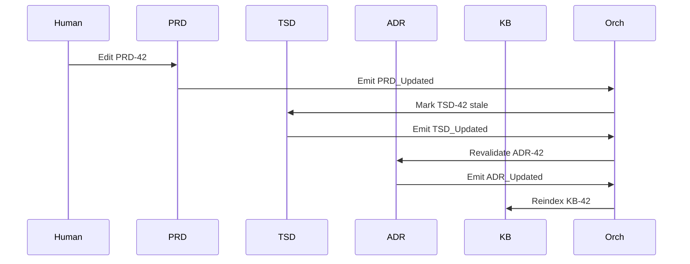

# **ADR-001: Hybrid Directed Graph Architecture with Selective Mesh Extensions**

**Status:** Accepted
**Date:** 2025-11-27
**Project:** SDLC_IDE
**Author:** System Architecture Team

---

# **1. Context**

The SDLC_IDE platform requires a multi-agent architecture capable of managing heterogeneous documentation types across the SDLC lifecycle while maintaining strict structural guarantees. The architecture must support:

* Clear upstream → downstream communication boundaries between core managers
* Deterministic and auditable lifecycle transitions
* User-defined extensions without compromising core SDLC integrity
* AI-driven analytics (embeddings, semantic search, clustering)
* Immutable observability of all state changes
* A safe, governed environment for extensibility

### **Key Constraints**

#### **Document & Communication**

* PRD remains human-authored and human-centric.
* TSD must be machine-readable, validated, and deterministically generated.
* Core flow is strictly: **PRD → TSD → ADR → KB**.
* No cycles allowed in the core DAG.
* Agent communication must be deterministic, explicit, and centrally validated.

#### **Extensibility**

Extensions:

* must *not* introduce cycles or mutate any core document
* must declare schema, allowed edges, embedding strategy, lifecycle
* must pass Orchestrator structural validation and Governor policy validation

#### **Observability & State**

* All state changes are emitted as immutable events (ADR-002).
* Embeddings (ADR-003) influence semantic navigation only — never structural flow.
* Workspace persistence (ADR-004) must preserve DAG + mesh topology across reloads/branches.

### **Key Design Questions**

* How to support custom document types safely?
* How to allow mesh flexibility without compromising core integrity?
* How to prevent unauthorized communication or structural violations?
* How to maintain decentralized mesh validation while preserving global invariants?

---

# **2. Decision**

SDLC_IDE adopts a **Hybrid Directed Graph Architecture** composed of three integrated layers:

1. **Core Strict Directed Acyclic Graph (DAG)** — authoritative SDLC pipeline
2. **Selective Mesh Layer** — user-defined extensions
3. **Event-Based Observer Layer** — immutable, append-only event log

---

# **A. Core Strict Directed Acyclic Graph (DAG)**

Authoritative lifecycle:

**PRD Manager → TSD Manager → ADR Manager → KB Manager**

### **Core Properties**

* No cycles — enforced by Orchestrator (ADR-005).
* Deterministic downstream propagation only.
* No gossip or opportunistic peer-to-peer communication.
* Fully governed by Orchestrator state machine.
* Full auditability and reproducibility.

### **Critical Governance Rule**

> **The Orchestrator MUST reject all Core mutations not originating from human-approved ADRs.**

This ensures that the Core lifecycle remains **100% human-governed**.

---

### **Core Agents & Flow Summary**

| Agent           | Responsibilities                                                             | Trigger       | Output        |
| --------------- | ---------------------------------------------------------------------------- | ------------- | ------------- |
| **PRD Manager** | Accepts human-authored PRDs, version controls artifacts, emits `PRD_Updated` | Human edit    | `PRD_Updated` |
| **TSD Manager** | Regenerates/validates TSD from PRD, ensures consistency, emits `TSD_Updated` | `PRD_Updated` | `TSD_Updated` |
| **ADR Manager** | Validates architectural decisions vs TSD, emits `ADR_Updated`                | `TSD_Updated` | `ADR_Updated` |
| **KB Manager**  | Indexes artifacts and semantic knowledge, emits `KB_Updated`                 | `ADR_Updated` | `KB_Updated`  |

---

# **B. Selective Mesh Layer (Extensions)**

The Mesh supports user-defined document types, lateral workflows, and semantic relationships *without affecting the Core*.

### **Mesh Characteristics**

* Entirely user-defined (schema, edges, lifecycle, embeddings).
* Mesh edges may connect:

  * Mesh → Mesh
  * Mesh → Core
  * Core → Mesh
* **Mesh cannot mutate or override Core nodes or their lifecycle transitions.**
* Orchestrator validates structural rules.
* Governor enforces ACL/policy/compliance.

### **Gossip Rules**

* Allowed only inside mesh clusters.
* Prohibited in Core DAG.
* Mesh gossip must not influence Core state.

### **Embedding Rules**

* Embeddings produce **semantic**, not structural links.
* Orchestrator always has final authority over lifecycle transitions.

### **Example Mesh Extension**

```yaml
type: ArchitectureDiagram
schema: diagram.schema.json
inbound_edges: ["ADR"]
outbound_edges: []
embedding_strategy: structural+image
lifecycle: mesh
```

---

# **C. Event-Based Observer Layer**

Immutable, append-only, schematized event stream (ADR-002).

### **Captures**

* All lifecycle transitions
* All agent-to-agent interactions
* All user edits
* All merges, rollbacks
* Embedding updates
* Validation failures, policy violations

### **Properties**

* Immutable
* Observational (never authoritative)
* Supports search, analytics, replay, governance
* Forms the foundation for debugging and auditing

---

# **3. High-Level Architecture Diagram**

```mermaid
graph TD
subgraph CoreDAG ["Core DAG (Authoritative SDLC Pipeline)"]
    direction TB
    PRD[PRD Manager] --> TSD[TSD Manager]
    TSD --> ADR[ADR Manager]
    ADR --> KB[Knowledge Manager]
end

subgraph Mesh ["Mesh Extensions (Flexible, User-Defined)"]
    direction TB
    Comp[Compliance Module]
    API[API Spec]
    Perf[Performance Model]
end

subgraph Gov ["Governance & Observation"]
    Orch[Orchestrator]
    Govr[Governor (OPA/Rego)]
    Events[Event Stream]
end

TSD -.-> API
TSD -.-> Perf
PRD -.-> Comp

Orch -- Governs --> PRD
Orch -- Governs --> TSD
Orch -- Governs --> ADR
Orch -- Governs --> KB
Orch -- Validates --> Mesh

Govr -- ACL/Policy --> Orch
Govr -- ACL/Policy --> Mesh

PRD -.- Events
TSD -.- Events
ADR -.- Events
KB -.- Events
Comp -.- Events
API -.- Events
Perf -.- Events
```

---

# **4. Rationale**

### **Why a Core DAG?**

* Natural model for SDLC
* Ensures deterministic progression
* Prevents backward mutation
* Guarantees reproducibility and compliance

### **Why a Mesh?**

* Provides unbounded extensibility
* Allows semantic and lateral relationships
* Separates experimentation from authoritative flow
* Enables AI-driven insights without violating governance

### **Why Hybrid?**

| Requirement         | DAG Only | Mesh Only | Hybrid |
| ------------------- | -------- | --------- | ------ |
| Strict SDLC flow    | ✅        | ❌         | ✅      |
| Extensibility       | ❌        | ✅         | ✅      |
| Predictability      | ✅        | ❌         | ✅      |
| Semantic links      | Limited  | ✅         | ✅      |
| Governance strength | Strong   | Weak      | Strong |
| Auditability        | High     | Low       | High   |

Only the hybrid approach satisfies **both deterministic governance and flexible extensibility**.

---

# **5. Consequences**

### **Positive**

* Deterministic, auditable lifecycle
* Strong governance with Orchestrator + Governor
* Safe extensibility through declarative mesh topology
* Complete traceability via immutable event logs
* Clear separation of authoritative vs semantic links

### **Negative**

* Higher orchestration complexity
* Extensions require schema + edge declarations
* Policy management adds overhead

### **Trade-offs**

* Mesh is flexible but not arbitrary
* All topology changes must be validated
* Gossip restricted to mesh
* Orchestrator must handle cycle detection + transactional writes

---

# **6. Alternatives Considered**

### **A. Full DAG**

Too rigid, unable to support semantic or lateral workflows.

### **B. Full Mesh**

Unsafe, nondeterministic, lacks governance guarantees.

### **C. Hub-and-Spoke**

Orchestrator becomes bottleneck; mesh expressiveness lost.

---

# **7. Decision Outcome**

**Accepted.**

SDLC_IDE will implement:

* Core strict DAG
* Selective mesh layer
* Immutable observational event stream
* Hybrid governance via Orchestrator + Governor

---

# **8. Dependencies & Cross-References**

### **Depends On:**

None — foundational.

### **Depended By:**

* ADR-002 Event Streaming
* ADR-003 Vectorization
* ADR-004 Persistence
* ADR-005 Orchestrator
* ADR-006 Custom Document Types
* ADR-007 Failure Modes
* ADR-009 Core System Agents

### **Required Updates to Other ADRs**

| ADR     | Update Needed                                | Status  |
| ------- | -------------------------------------------- | ------- |
| ADR-002 | Ordering guarantees for DAG artifacts        | Pending |
| ADR-003 | Embeddings must defer to Orchestrator        | Pending |
| ADR-004 | Workspace enforces DAG + mesh topology       | Pending |
| ADR-005 | Cycle detection + mesh validation algorithms | Pending |
| ADR-006 | Extension schema + edge declarations         | Pending |
| ADR-007 | Align failure modes with event layer         | Pending |

---

# **9. Implementation Notes**

### **ADR-005 Orchestrator**

Must implement:

* Core lifecycle state machine
* Cycle detection
* Mesh edge validation
* Transaction boundaries
* Governor integration
* Event ingestion (observational)

### **ADR-004 Persistence**

Workspace must:

* Separate core from extensions
* Support branching/merging/rollback
* Enforce transactional writes
* Model topology (DAG + mesh) explicitly

### **ADR-006 Extensions**

Custom types must:

* Declare schema, edges, embeddings
* Pass Orchestrator + Governor validation
* Emit events on change

---

# **10. Open Questions**

| Question             | Answered In | Status  |
| -------------------- | ----------- | ------- |
| Mesh edge validation | ADR-005     | Pending |
| ACL model            | ADR-005/006 | Pending |
| Transaction model    | ADR-004/005 | Pending |
| Failure handling     | ADR-007     | Pending |

---

# **11. Glossary**

| Term             | Definition                                          |
| ---------------- | --------------------------------------------------- |
| **DAG**          | Authoritative SDLC flow with no cycles              |
| **Mesh**         | Flexible extension layer for user-defined documents |
| **Orchestrator** | Structural/lifecycle enforcement engine             |
| **Governor**     | OPA/Rego policy engine (ACL, compliance)            |
| **Embedding**    | Vectorized semantic representation                  |
| **Event**        | Immutable observation of system activity            |
| **Workspace**    | Version-controlled repository of artifacts + state  |
| **Gossip**       | Peer-to-peer messaging allowed only within mesh     |

---

# **12. Appendix — Example State Transition**

**Human updates PRD-42**

1. `PRD_Updated` emitted
2. Orchestrator marks TSD-42 pending_sync
3. TSD regenerates → `TSD_Updated`
4. Orchestrator revalidates ADR
5. ADR emits `ADR_Updated`
6. KB reindexes
7. Final state: **PRD-42 → TSD-42 → ADR-42 → KB-42**

### **Optional Sequence Diagram**



---