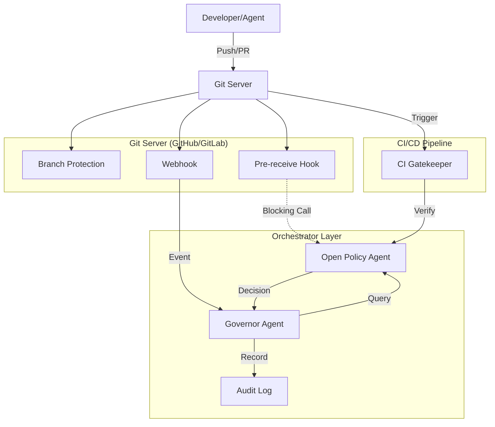

# ADR-003: Orchestrator Governance via OPA and Governor Agent

## 1. Context
ADR-001 established a Hybrid Directed Graph Architecture where an **Orchestrator** governs interactions between the Core DAG and Mesh Extensions. ADR-002 established an Event Layer for observability.

We now need to define the **implementation of the Orchestrator**. Specifically, we need a mechanism to:
1.  **Enforce Policies:** Ensure rules like "ADRs must be merged via PR" or "Extensions cannot depend on Core" are technically enforced, not just documented.
2.  **Decouple Policy from Code:** Allow governance rules to evolve without rewriting the Orchestrator's core logic.
3.  **Scale Validation:** Handle complex validation logic (ACLs, graph cycles) efficiently.

## 2. Decision
We will implement the Orchestrator using a **Governor Agent + Open Policy Agent (OPA)** pattern, enforcing rules at multiple layers (Git Server, Orchestrator, CI).

### A. High-Level Architecture
The architecture follows a "Defense in Depth" strategy:



### B. Enforcement Layers
We define three complementary enforcement layers to ensure "ADRs must be merged via PR":

1.  **Layer 1: Git Server Native (First Line)**
    *   **Mechanism:** Branch protection rules on `main`/`master`.
    *   **Rule:** Require Pull Request merges; disallow direct pushes.
    *   **Rule:** Require status checks (CI) and code owner reviews.

2.  **Layer 2: Orchestrator Governance Agent (The Brain)**
    *   **Mechanism:** Receives webhooks for push/merge events.
    *   **Flow:**
        1.  Constructs OPA input (Event type, Actor, Changed files, PR metadata).
        2.  Queries OPA policy.
        3.  **Action:** If `allow: false`, it triggers remediation (revert commit, block downstream pipelines, notify owners).
        4.  **Audit:** Logs the decision and input for non-repudiation.

3.  **Layer 3: CI Gating (User Feedback)**
    *   **Mechanism:** A CI job (e.g., GitHub Actions) running `conftest` or `opa eval`.
    *   **Rule:** Fails the PR build if the Rego policy is violated, providing immediate feedback to the developer.

## 3. Implementation Details

### A. OPA Policy Design (`adr_policy.rego`)
We will use a dedicated Rego policy to enforce ADR immutability and process.

**Policy Logic:**
*   **Input:** JSON payload from Webhook/Governor.
*   **Rules:**
    *   Allow if no ADR files are changed.
    *   Allow if ADR files are changed AND event is a `pull_request` merge.
    *   Allow if ADR files are changed AND push is a merge commit tied to a PR (best-effort for direct pushes).
    *   **Strictness:** Can be extended to require N reviewers.

### B. Data Schema
**Sample OPA Input:**
```json
{
  "event_type": "pull_request",
  "action": "closed",
  "pull_request": {
    "number": 42,
    "merged": true,
    "merged_by": { "login": "alice" },
    "approvals": 2
  },
  "changed_files": [
    "docs/adr/adr-001-hybrid-graph.md"
  ],
  "actor": "alice",
  "repo": "org/SDLC_IDE",
  "branch": "main"
}
```

## 4. Consequences

### Positive
*   **Defense in Depth:** Multiple layers ensure that if one fails (e.g., CI is skipped), another catches it (Governor Agent).
*   **Policy as Code:** Rules are centralized in Rego, version-controlled, and testable.
*   **Auditability:** Every decision is logged with its input, providing a clear compliance trail.
*   **Bot Compatibility:** Automated agents follow the same PR process, ensuring they don't bypass governance.

### Negative
*   **Setup Complexity:** Requires configuring Git hooks, Webhooks, CI jobs, and an OPA server.
*   **Latency:** Pre-receive hooks (if used) add latency to git pushes.

## 5. Roadmap
1.  **Phase 1 (Immediate):** Implement `adr_policy.rego` and add CI gating (Layer 3).
2.  **Phase 2:** Deploy Governor Agent to handle Webhooks (Layer 2) for audit logging.
3.  **Phase 3:** Explore Pre-receive hooks (Layer 1 extension) for strict server-side blocking if needed.
