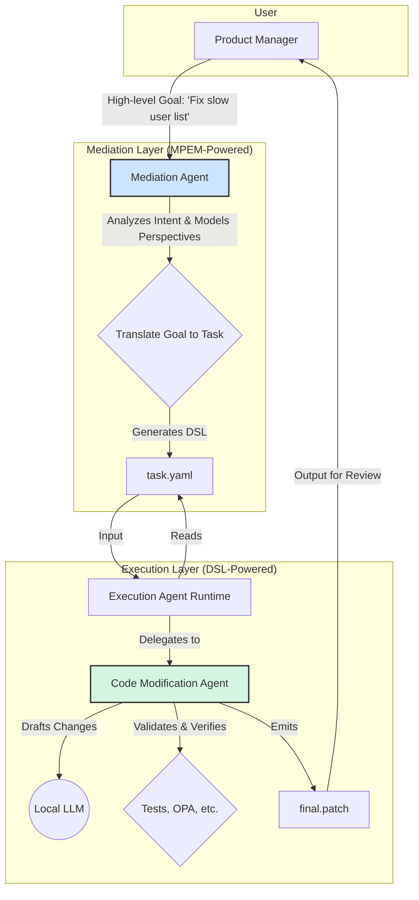

# ADR-001: Two-Layer Agent Architecture

*   **Status**: Proposed
*   **Date**: 2025-11-28
*   **Deciders**: Jules, User

## Context

The project requires an agent-based system for managing the software development lifecycle (SDLC). We need an architecture that is both intelligent and safe, allowing for flexible, goal-oriented interaction with human users while ensuring deterministic, governable execution of tasks.

Two key concepts have been introduced:
1.  **Multi-Perspective Empathic Mediation (MPEM)**: A framework for understanding and mediating between different mental models (perspectives) to translate high-level human intent into actionable tasks. This provides the "why."
2.  **Agent Task DSL**: A declarative YAML-based Domain-Specific Language for defining specific, deterministic tasks like code modification, documentation generation, and dependency updates. This provides the "what" and "how."

We need a design that harmonizes these two concepts into a coherent and robust system.

## Decision

We will adopt a **two-layer agent architecture** composed of a **Mediation Layer** and an **Execution Layer**.

1.  **Mediation Layer**:
    *   **Core Technology**: MPEM Framework.
    *   **Responsibility**: Acts as the primary interface for human users. It is responsible for understanding high-level, natural language goals, modeling the perspectives of the user and the system, and translating that intent into a concrete, machine-readable task definition.
    *   **Output**: A declarative task file written in the Agent Task DSL (YAML).

2.  **Execution Layer**:
    *   **Core Technology**: Agent Runtime Skeleton and Agent Task DSL.
    *   **Responsibility**: Consists of specialized, deterministic agents that execute the tasks defined in the DSL files. These agents are not responsible for understanding broad intent; they are responsible for correctly and safely performing a specific, well-defined operation (e.g., modifying a function, running tests, applying a patch).
    *   **Input**: A task file in the Agent Task DSL (YAML).

This separation of concerns allows the system to be both flexible and predictable. The Mediation Layer handles the "fuzzy" front-end of human interaction, while the Execution Layer provides a safe, auditable, and deterministic back-end.

## Consequences

*   **Pros**:
    *   **Safety and Governance**: The deterministic nature of the Execution Layer makes it easy to apply governance rules (e.g., via OPA) and ensure that agents only perform allowed actions.
    *   **Clarity and Simplicity**: Each layer has a single, well-defined responsibility. Execution agents are simple and stateless.
    *   **Extensibility**: New execution agents can be added to support new DSL task types without changing the Mediation Layer.
    *   **Testability**: The deterministic execution agents are easy to test in isolation. The DSL provides a clear contract for integration testing.
*   **Cons**:
    *   **Increased Indirection**: A user's request must be translated into a DSL file before it can be executed, which introduces an extra step.
    *   **DSL Maintenance**: The Agent Task DSL will need to be versioned and maintained as the capabilities of the system evolve.

## Workflow Example

1.  A **Product Manager** provides a high-level goal: "The user list is too slow. We need to add pagination."
2.  The **Mediation Agent** (MPEM-powered) analyzes the request:
    *   It models the PM's perspective (goal: improve UX) and the system's perspective (constraint: maintain API standards).
    *   It translates this into a specific technical plan: add `limit/offset` parameters to the `/users` route.
    *   It generates a `code_modification` task in the DSL.
3.  The generated YAML task is passed to the **Execution Layer**.
4.  The `code_modification` **Execution Agent** receives the task.
    *   It loads the task, builds a deterministic plan, and uses a local LLM to draft the necessary code changes.
    *   It runs validation (tests, static analysis, diff size checks).
    *   It verifies the change against OPA governance policies.
    *   It emits a patch file for human review.

## Architecture Diagram

This ADR formally establishes the two-layer architecture as the foundational design for the agent system. Future ADRs will build upon this decision.
