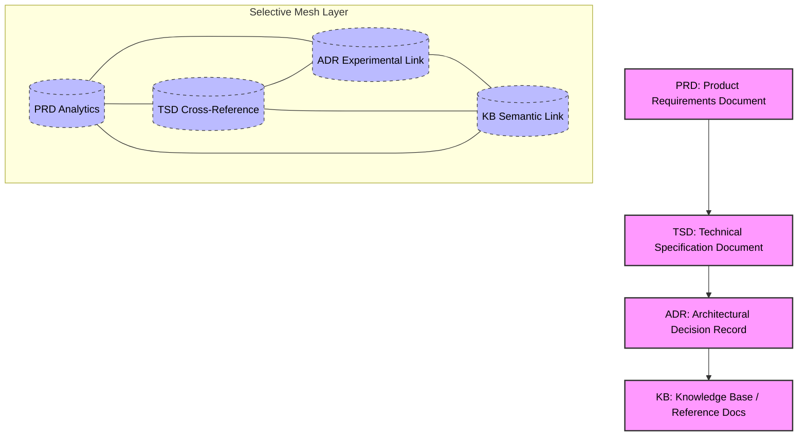

# ADR-000: Hybrid Directed Graph Architecture with Selective Mesh Extensions

## 1. Context

The **SDLC_IDE platform** requires a multi-agent architecture capable of managing diverse SDLC artifacts while maintaining strict structural and process guarantees. The system must:

* Enforce deterministic core lifecycle transitions for all documentation types (PRD, TSD, ADR, KB).
* Support **user-defined extensions** without compromising core integrity.
* Maintain clear separation between human-driven approvals and machine-driven automation.
* Enable flexible analytics, versioning, and multi-agent collaboration.

Traditional purely directed or purely mesh architectures are insufficient:

* **Directed Graph (DAG) only:** Guarantees linear, verifiable flows but is rigid and hard to extend.
* **Mesh only:** Offers flexibility and dynamic relationships but risks loss of core lifecycle integrity and auditability.

**Goal:** Combine the **deterministic guarantees of a DAG** with the **flexibility of a selective mesh layer** for extensions, semantic relationships, and experimental workflows.

---

## 2. Decision

Adopt a **hybrid architecture**:




```mermaid
%% Compact Hybrid Directed Graph: Core DAG + Selective Mesh
flowchart TD
    %% Core DAG nodes
    PRD[PRD: Product Requirements Document]
    TSD[TSD: Technical Specification Document]
    ADR[ADR: Architectural Decision Record]
    KB[KB: Knowledge Base / Reference Docs]

    %% Core DAG flow
    PRD --> TSD
    TSD --> ADR
    ADR --> KB

    %% Mesh extensions as dashed connections
    PRD --- ADR
    PRD --- TSD
    TSD --- KB
    TSD --- ADR
    ADR --- KB
    KB --- PRD

    %% Styling
    classDef core fill:#f9f,stroke:#333,stroke-width:2px,color:#000;
    classDef mesh fill:none,stroke:#1f77b4,stroke-width:1px,color:#000,stroke-dasharray: 5 5;

    class PRD,TSD,ADR,KB core;
    linkStyle 4,5,6,7,8,9 stroke-dasharray: 5 5,stroke:#1f77b4,stroke-width:1px;
```

### ✅ Features Captured

1. **Core DAG**: Linear flow from PRD → TSD → ADR → KB (enforces lifecycle).
2. **Selective Mesh**: Optional, explicitly declared relationships (dashed links) for experimental or cross-document use.
3. **Clear separation**: Core nodes are highlighted differently from mesh nodes for visual clarity.
4. **Orchestrator rules implied**: Mesh can’t mutate the core, DAG mutations require human-approved ADRs.

1. **Core Directed Graph (DAG)**

   * Represents the official SDLC artifact flow: PRD → TSD → ADR → KB.
   * Enforces lifecycle rules deterministically.
   * All mutations in the core DAG **must originate from human-approved ADRs**.

2. **Selective Mesh Extensions**

   * Overlay relationships for experimental workflows, cross-document references, or analytics-driven insights.
   * Only **explicitly declared extensions** are allowed; the mesh layer cannot modify the core DAG.
   * Provides dynamic linking and discovery while maintaining auditability.

3. **Orchestrator Enforcement Rules**

   * Reject any core DAG mutation that is not human-approved.
   * Validate mesh additions for schema compatibility but allow runtime flexibility.
   * Maintain cross-reference consistency between DAG and mesh extensions.

---

## 3. Consequences

* **Pros**

  * Strong structural integrity for core SDLC processes.
  * Flexibility for experimentation, analytics, and semantic relationships.
  * Clear separation of responsibilities: human approvals vs AI/machine-driven workflows.

* **Cons / Risks**

  * Complexity of hybrid enforcement (DAG + mesh validation).
  * Potential cognitive overhead for agents and humans interpreting cross-layer links.
  * Requires robust tooling for visualization and orchestration to prevent errors.

* **Mitigations**

  * Automated validation pipelines for DAG vs mesh coherence.
  * Context bridging documentation for all mesh relationships.
  * Monitoring of cross-reference density and system complexity metrics.

---

## 4. Alternatives Considered

| Alternative                 | Reason Rejected                                                                                |
| --------------------------- | ---------------------------------------------------------------------------------------------- |
| Pure DAG                    | Too rigid; cannot support dynamic relationships and analytics extensions.                      |
| Pure Mesh                   | Lacks verifiable lifecycle guarantees; core processes may be compromised.                      |
| Layered DAG with Soft Links | Intermediate solution, but lacks explicit orchestration rules and may introduce silent errors. |

---

## 5. References

* SDLC_IDE multi-agent architecture requirements
* Core lifecycle enforcement policies
* AI-driven analytics workflows
