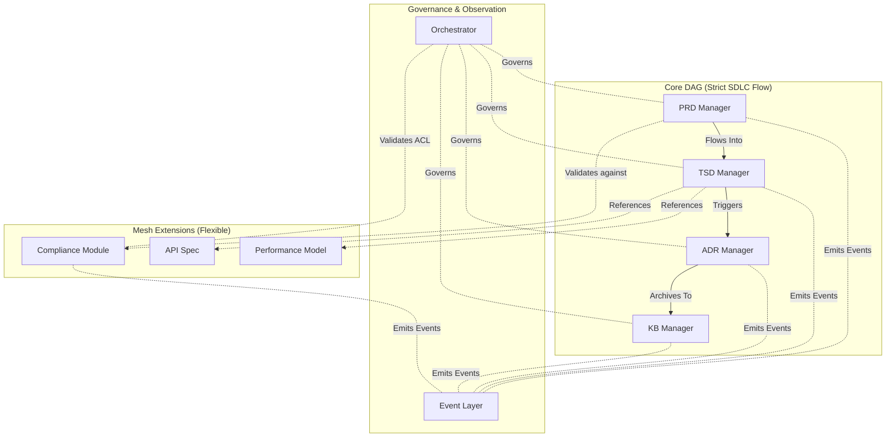

# ADR-000: Hybrid Directed Graph Architecture with Selective Mesh Extensions

## 1. Context

SDLC_IDE requires a multi‑agent system capable of managing all document artifacts throughout the software development lifecycle. The system must support:
- **Strict communication boundaries** between core document managers
- **Deterministic and auditable** lifecycle transitions
- **Machine‑readable processing** for technical specifications
- **Human‑readable workflows** for product requirement documents
- **Integration of user‑defined document types** without destabilizing core flows
- **AI‑assisted analytics** using embeddings, event observations, and semantic reasoning
- **Secure, orchestrator‑governed interactions** between agents

### Key Constraints

- **PRD remains human‑centric**; TSD must be machine‑readable and machine‑verifiable.
- **Core document agents follow the strict lifecycle:**
  `PRD → TSD → ADR → KB`
- **Extensions** (custom doc types, schemas, agents, and relations) must be allowed without compromising core flow.
- **Communication rules must enforce:**
  - Determinism
  - Security
  - Predictability
  - Zero implicit propagation
- **Extensions must never introduce cycles** or upstream influence on the Core DAG.

### Key Questions

- How can custom document types integrate safely?
- How can structure remain strict while allowing extensibility?
- How can agent communication avoid unnecessary network traffic and unauthorized propagation?

**Conclusion:** A hybrid architecture is needed to maintain structure and flexibility.

## 2. Decision

SDLC_IDE will adopt a **Hybrid Directed Graph Architecture** consisting of:

### A. Core Directed Acyclic Graph (DAG)

Defines dependencies and communication boundaries for core SDLC documents:
`PRD Manager → TSD Manager → ADR Manager → KB/Knowledge Managers`

**Properties:**
- No cycles
- Deterministic propagation
- Strict, enforced boundaries between agents
- Fully aligned with SDLC behavioral flow
- Zero gossip or lateral traffic
- All rules enforced by the Orchestrator
- Guarantees predictability, auditability, and reproducibility

The Core DAG represents the authoritative SDLC lifecycle.

### B. Selective Mesh Extension Layer (Flexible, User‑Defined)

Supports arbitrary, user‑defined document types and multi‑directional semantic relations.

**Mesh characteristics:**
- Nodes declare allowed inbound/outbound edges (declarative ACL).
- Mesh edge validation rules, cycle detection, and ACL enforcement are defined in ADR-004 (Orchestrator). ADR-001 establishes only the architectural boundary.
- Extensions cannot modify or override the Core DAG.
- Extensions cannot become upstream inputs to Core nodes.
- **Core → Extension links are allowed**.
- **Extension → Core links are only allowed** as non-structural declarative metadata, never as dependencies.

**Allowed Core → Extension Scenarios:**
1. **Detail Extension**: TSD references an external API spec, data dictionary, or performance model.
2. **Executable Artifacts**: Extension provides schemas, validators, test generators, or models.
3. **Compliance / Regulation / Audit Add‑Ons**: PRD or TSD declares compliance with a specific regulatory module.
4. **Contract Boundaries**: Extension documents define external integration contracts.
5. **User‑Defined Extensions**: Arbitrary new doc types defined by teams without modifying the core.

**Optional mesh features:**
- Gossip‑style coordination is allowed *only* within mesh clusters and must never influence Core DAG decisions.
- Local collaboration within extension sets.
- Semantic link inference via embeddings (never structural inference). Structural validation comes from orchestrator + schema validation. Semantic inference comes from embeddings (see ADR-003).

### C. Event‑Based Observer Layer (Separate from Graph Structure)
A distributed event streaming system (technology selected via ADR‑002) captures:
- Document lifecycle events
- Agent communications
- User interactions
- Version control changes
- Embedding updates
- Policy feedback to the Orchestrator

**The event layer:**
- Cannot modify the Core DAG
- Cannot alter mesh topology
- Provides analytics, recommendations, and insights
- Powers ML models and AI‑driven personalization

This maintains a strict separation between structure and behavior.

## 3. Rationale

### Why the Core is a DAG
- Reflects true SDLC flow
- Prevents invalid updates
- Ensures reproducibility
- Creates a single source of truth
- Enforces strict agent boundaries
- Avoids wasteful or unauthorized communication

### Why add a Mesh
- Teams need domain‑specific documents
- Knowledge graphs rely on many‑to‑many semantics
- Extensions should not compromise core stability
- Provides flexible cross‑linking outside the lifecycle pipeline

### Why Hybrid
- A pure DAG is too rigid.
- A full mesh is too chaotic.
- A hybrid model provides the best of both:

| Requirement | DAG | Mesh | Hybrid |
| :--- | :---: | :---: | :---: |
| Strict SDLC flow | ✔️ | ✖️ | ✔️ |
| Extensibility | ✖️ | ✔️ | ✔️ |
| Predictability | ✔️ | ✖️ | ✔️ |
| Semantic linking | Limited | ✔️ | ✔️ |
| Safety | ✔️ | Risky | ✔️ |

The Hybrid Directed Graph Architecture satisfies all operational and architectural needs.

## 4. Consequences

### Positive
- **Strong governance** via Orchestrator
- **Deterministic lifecycle:** `PRD → TSD → ADR → KB`
- **Safe extensibility** without corrupting core
- **Supports domain‑specific** documentation ecosystems
- **Clear visualization** and dependency mapping
- **Compatible with embedding‑based** semantic reasoning
- **Suitable for audits**, compliance, and impact analysis

### Negative
- More complex than a single‑model graph.
- Mesh nodes require explicit schema and ACL definitions, as detailed in ADR-005 (Custom Document Type Integration).
- Validation logic must prevent accidental cycles.

### Neutral / Tradeoffs
- Extensions are powerful but must be declared upfront
- Orchestrator approval is required for graph mutations
- Some teams may need training to define safe extension schemas

## 5. Alternatives Considered

### A. Full DAG Only
**Rejected because:**
- Too rigid
- Cannot support knowledge graph semantics
- No custom doc types
- No many‑to‑many relations

### B. Full Mesh Only
**Rejected because:**
- Lifecycle rules become unenforceable
- Easy to introduce cycles
- Agent behavior becomes unpredictable
- Violates SDLC compliance and governance

### C. Hub‑and‑Spoke Architecture
**Rejected because:**
- Orchestrator becomes a critical bottleneck
- All relations must pass through a single point
- Not flexible for rich semantic links

## 6. Decision Outcome
**Pending**

SDLC_IDE will use a **Hybrid Directed Graph Architecture** composed of:
1. **Core DAG** (strict SDLC flow)
2. **Selective Mesh Extensions** (flexible, safe, user‑defined)
3. **Event Layer** (analytics, ML, monitoring)
4. **Orchestrator** governing all structural and behavioral rules

This ADR becomes the foundation for the entire SDLC_IDE architecture.
