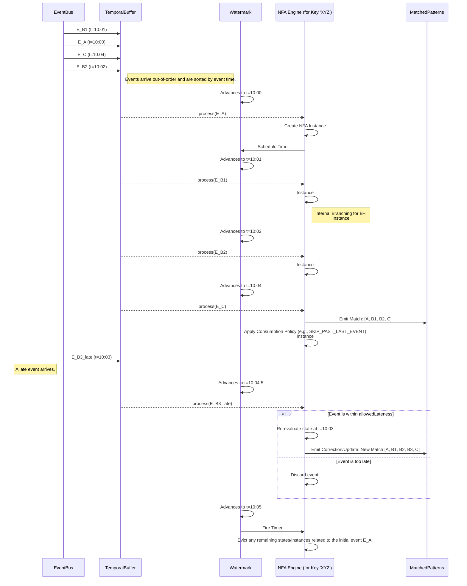

# ADR-001: Complex Event Processing Engine

*   **Status**: Proposed
*   **Date**: 2025-11-27
*   **Deciders**: Jules
*   **Technical Story**: To build a high-performance, low-latency CEP engine for the Event-Based Observer Layer.

**Supporting Documents**:
*   For concrete implementation examples, see the [CEP Implementation Guide](../../implementation/cep-implementation-guide.md).
*   For a detailed technical breakdown of the engine's internals, see the [CEP Internal Mechanics Deep Dive](../../implementation/cep-internal-mechanics.md).

## Context and Problem Statement

The SDLC_IDE architecture relies on an Event-Based Observer Layer to provide insights and drive AI-assisted features. To effectively analyze the high-volume event streams generated by the Core DAG and Mesh extensions, we require a sophisticated Complex Event Processing (CEP) engine. This engine must be capable of identifying complex patterns, managing out-of-order events, and handling late-arriving data to ensure both correctness and performance.

The primary challenge is to design a system that balances correctness, latency, and resource consumption. This ADR defines the core mechanics of the CEP engine, including the NFA instance lifecycle and the watermark-based strategy for managing event time.

## Decision Drivers

*   **Correctness**: The CEP engine must produce accurate results even when events are out-of-order.
*   **Performance**: The engine must be able to handle a high throughput of events with low latency.
*   **Resource Management**: The engine must have a clear strategy for managing state and preventing memory leaks (state explosion).
*   **Configurability**: The trade-offs between latency and correctness should be configurable to adapt to different use cases.

## Considered Options

*   **Custom Build**: A custom-built CEP engine tailored to the specific needs of the SDLC_IDE.
*   **Off-the-shelf Solution**: Integrating an existing open-source CEP engine like Apache Flink or Siddhi.

This ADR focuses on the design of a custom-built engine, but the principles outlined here can be applied to the configuration of an off-the-shelf solution as well.

## Decision

We will implement a custom CEP engine based on a Nondeterministic Finite Automaton (NFA) model. The engine will manage event time using a watermark mechanism and a temporal buffer to handle out-of-order and late events.

### Definitive End-to-End CEP Lifecycle Diagram

This diagram illustrates the full, production-grade lifecycle of NFA instances for a given key. It visually integrates out-of-order event ingestion, watermark progression, NFA instance branching for greedy patterns, event-time timers, late event handling with retractions, and the application of consumption policies.

### 1. Core Principles

The engine's design is based on a set of core principles that ensure deterministic and memory-safe execution. For a detailed breakdown of these concepts, see the [CEP Internal Mechanics Deep Dive](../../implementation/cep-internal-mechanics.md).

*   **NFA Instance Branching**: To handle greedy or repeating patterns (e.g., `oneOrMore()`), the engine internally tracks all possible partial matches simultaneously. This allows it to generate all valid overlapping matches but requires careful memory management.
*   **Event-Time Timers**: To enforce temporal constraints (e.g., `within(...)`), each partial match schedules an event-time timer. If the pattern does not complete before the watermark passes the timer, the corresponding instance is automatically evicted.
*   **Watermark-Driven Processing**: The watermark acts as the engine's "commit point." A temporal buffer holds out-of-order events, and the engine only releases them to the NFA logic when the watermark has passed their timestamp. This ensures the NFA *never* sees out-of-order events.
*   **Late-Event Handling**: A configurable `allowedLateness` period allows the engine to process events that arrive after the watermark has passed. This may trigger retractions or corrections to previously emitted matches, trading higher correctness for increased computational cost.
*   **Consumption Policies**: Policies like `SKIP_TO_NEXT` and `SKIP_PAST_LAST_EVENT` control how the engine prunes or retains partial matches after a full match is found, which is critical for managing state and defining whether overlapping matches are desired.

### 2. Key Tuning Knobs in Production

When implementing or tuning a CEP system, the most important configurable parameters are:
*   **Out-of-orderness Bound (L)**: Controls the watermark lag and the memory footprint of the temporal buffer.
*   **Allowed Lateness**: Defines the window for result updates versus finality. A larger window increases correctness but also computational cost.
*   **Idle State Retention / Timeout**: A crucial mechanism to automatically evict dormant partial matches and prevent state explosion, even for patterns without explicit `within` clauses.

## Consequences

### Positive
*   **Correctness by Design**: The use of watermarks and a temporal buffer ensures that the CEP engine produces correct, deterministic, and replayable results.
*   **Robust State Management**: The combination of timers, watermarks, and consumption policies provides a robust mechanism for preventing memory leaks (state explosion).
*   **Configurability**: The core trade-offs between latency, correctness, and resource consumption are exposed as tunable parameters.

### Negative
*   **Increased Complexity**: The implementation and tuning of the CEP engine is significantly more complex than a simple event processor.
*   **Latency**: The watermark delay and temporal buffering introduce inherent latency.
*   **Memory Usage**: The temporal buffer and the storage of NFA instances consume memory.
