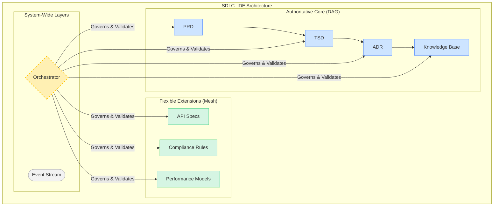

# ADR-001: Executive Summary Diagram

This diagram provides a high-level, "one-page" executive view of the Hybrid Directed Graph Architecture, suitable for stakeholder presentations. It illustrates the relationship between the three primary layers of the system at a glance.

