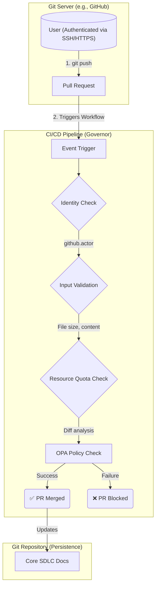

# ADR-001: Git-Native Resource Governance

*   **Status:** Proposed
*   **Date:** 2025-11-27
*   **Deciders:** Jules, User

## Context

The SDLC_IDE is a multi-agent system that performs automated tasks such as code analysis and PR generation. To operate safely, the system requires robust resource allocation and safety guardrails to prevent abuse, manage compute resources, and handle potentially runaway tasks triggered by user input.

A primary architectural constraint of this project is that **Git is the only persistence mechanism**. This means the system has no built-in concept of users, identities, sessions, or quotas. Git's authorship metadata is trivially forgeable, and it cannot distinguish between legitimate and malicious users.

This leads to the core problem: **How can the system enforce identity, quotas, and safety guardrails in a Git-only persistence model?** The initial concept of a stateful "Resource Allocator Agent" is not viable as it presumes a server-side identity layer that does not exist. Enforcement must happen *outside* of the core `git` persistence logic.

## Decision

We will implement resource governance and safety guardrails using a **stateless, event-driven CI/CD pipeline** (e.g., GitHub Actions). This pipeline will act as the system's governor, leveraging the identity management of the underlying Git server (e.g., GitHub, GitLab) where users are already authenticated.

The "Resource Allocator Agent" will not be a long-running process but a set of scripts and policy checks within the CI pipeline. This pipeline will be triggered by Git events (e.g., `pull_request`) and will perform the following actions:

1.  **Identity Verification:** Use the CI/CD provider's environment variables (e.g., `github.actor`) to reliably identify the user initiating the event.
2.  **Input Validation:** Filter inputs by size, content, and other heuristics to reject potentially malicious requests.
3.  **Resource Quota Enforcement:** Analyze the diff to enforce limits on file size, number of changes, etc.
4.  **Policy Checks:** Run OPA policies to ensure changes conform to the system's governance rules.
5.  **Gating:** If any check fails, the pipeline fails, blocking the pull request from being merged.

This approach layers identity and enforcement on top of the Git persistence layer without requiring a separate stateful application server.

### System Architecture

## Consequences

### Positive Consequences

*   **No Custom Identity Service:** Avoids the complexity of building and maintaining a separate, stateful identity and session management service.
*   **Leverages Existing Security:** Relies on the robust, battle-tested security of the underlying Git server (e.g., GitHub, GitLab) for user authentication.
*   **Stateless and Git-Native:** Keeps the core system stateless and aligned with the "Git-as-persistence" philosophy.
*   **Versioned Governance:** Governance rules (e.g., OPA policies, workflow configurations) are stored and versioned within the repository itself.

### Negative Consequences

*   **Provider Lock-in:** Tightly couples the system's governance to a specific CI/CD provider. Migrating (e.g., from GitHub Actions to GitLab CI) would require rewriting the enforcement logic.
*   **Asynchronous Enforcement:** Governance checks are performed at discrete points (e.g., on pull request creation), not in real-time. This prevents dynamic, in-flight resource allocation adjustments.
*   **Does Not Prevent Forking:** The guardrails only protect the canonical repository. Malicious actors can still fork the repository and run agents without limits in their own environment.

## Non-Functional Requirements

*   The CI/CD environment must have access to necessary tools, including OPA, Conftest, and Git.
*   The pipeline must be configured to be non-bypassable for all relevant branches and events (e.g., via branch protection rules).

## Open Questions

| Question | Resolving ADR | Status | Owner |
| :--- | :--- | :--- | :--- |
| How will we manage quotas for compute-intensive tasks that run within the CI/CD pipeline itself? | | `Open` | `@user` |
| How can we provide users with clear feedback when their PR is blocked by a governance policy? | | `Open` | `@user` |

---
*This decision record synthesizes the initial design document and subsequent architectural discussions.*
