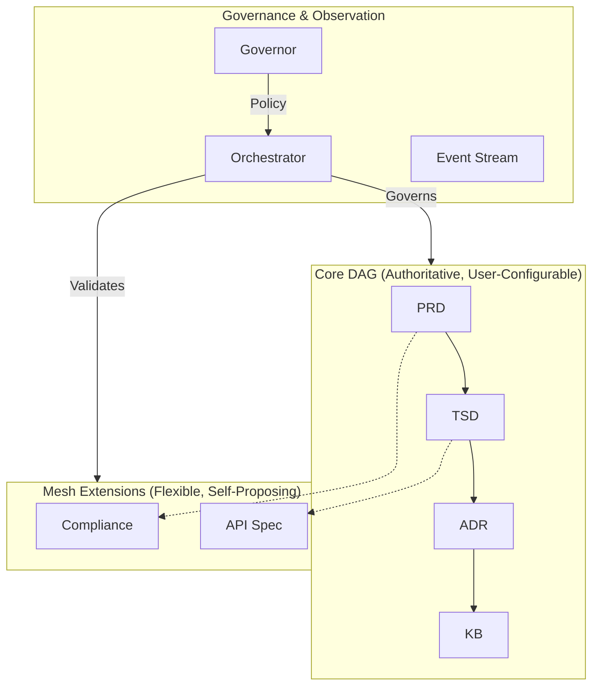

# 1. Context
The SDLC_IDE platform requires a multi-agent architecture to manage SDLC artifacts. The system must enforce a verifiable core SDLC lifecycle while supporting **user-defined custom workflows** and the **autonomous evolution of the Mesh layer** through self-proposing extensions.

**Key Requirements:**
- A strict, immutable Core DAG for canonical SDLC artifacts.
- A flexible Mesh layer that can safely evolve at runtime via an autonomous, agent-driven proposal system.
- Central governance via an Orchestrator and Governor (OPA/Rego) to enforce all structural, policy, and security rules.

# 2. Decision
We adopt a **Hybrid Directed Graph Architecture** with a **Self-Proposing Extensions** model for the Mesh layer, composed of four coordinated layers:
- **Core Directed Acyclic Graph (DAG):** Authoritative, user-configurable SDLC workflow.
- **Mesh Extension Layer:** Flexible semantic graph that evolves via the Self-Proposing Extensions pipeline.
- **Event-Based Observer Layer:** Immutable event stream for analytics and observability.
- **Central Orchestrator & Governor:** Enforces all rules, validates proposals, and mediates all graph mutations.

# 3. High-Level Architecture Diagram


# 4. Core DAG (Authoritative, Acyclic, User-Configurable)
The Core DAG defines the authoritative SDLC lifecycle. Its sole invariant is **acyclicity**. While a default `PRD → TSD → ADR → KB` pipeline is provided, teams can register custom pipelines, which are validated by the Orchestrator. (See Appendix A). Custom workflows operate as independent DAGs within the Mesh Extension Layer and do not modify or extend the Core SDLC DAG.

# 5. Mesh Extension Layer (Flexible, Self-Proposing)
The Mesh Layer supports arbitrary user-defined documents and evolves through the **Self-Proposing Extensions Architecture**, where agents autonomously discover needs and propose new Mesh types. All proposals are validated by the Orchestrator and Governor. (See Appendix B).

# 6. Event-Based Observer Layer
An immutable, append-only event stream (per ADR-002) that provides full system observability without being authoritative for state. This maintains a strict separation between **structure** (graph) and **behavior** (events).

# 7. Rationale
The hybrid model is the only one that supports both **formal lifecycle guarantees** and **flexible, autonomous extensibility**.

# 8. Decision Outcome
**Accepted.** This ADR establishes the foundational architecture for the SDLC_IDE platform.

---

## Appendix A — Custom Workflow Registration & Enforcement

### Summary
Teams may register custom SDLC workflows via a declarative registry. The system-provided default pipeline is `PRD → TSD → ADR → KB`, but any pipeline is allowed as long as it is acyclic, type-safe, and policy-approved.

### Governance & Enforcement
Workflow changes are PR-based and must pass a series of validation checks before activation:
1.  **Acyclicity Checks** (Topological validation)
2.  **Type Safety Verification** (Nodes map to known artifact types)
3.  **ACL & OPA Policy Validation**
4.  **Backward-Compatibility Checks** (Ensures no existing artifacts are stranded)

Upon merge, the Orchestrator performs a final validation, activates the workflow, and logs the event for a full audit trail.

---

## Appendix B — Self-Proposing Extensions Architecture

### Summary
Agents autonomously discover needs, generate **Mesh Extension Specs (MES)**, and propose them for registration.

### Validation Pipeline
Proposals undergo a mandatory 2-stage validation:
1.  **Orchestrator:** Validates structural safety (e.g., cycle detection, DAG isolation).
2.  **Governor:** Enforces non-structural rules (e.g., security, compliance, ACLs).

### Registration
Validated proposals are autonomously registered in the **Mesh Registry**, making new types available at runtime without human intervention. The Core DAG remains untouched.

### Diagram of the Proposal Pipeline
```mermaid
graph TD
    A[Autonomous Agents<br/>(Discovery & Proposal Gen)] --> B(Mesh Extension Spec);
    B --> C{Validation};
    C --> D[ORCHESTRATOR<br/>Structural Rules];
    C --> E[GOVERNOR<br/>Policy + ACLs];
    D --> F{Result};
    E --> F;
    F -- Pass --> G[MESH REGISTRY<br/>(Dynamic Types)];
    G --> H(Runtime Mesh Layer);
    F -- Fail --> I([Proposal Rejected]);
```
