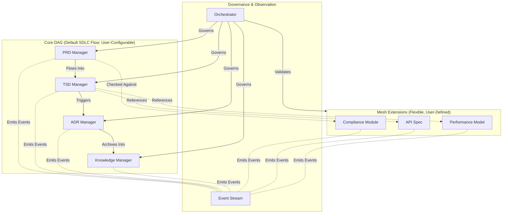

## 1. Context
SDLC_IDE requires a multi-agent architecture that:
*   Manages all documentation types across the SDLC lifecycle
*   Enforces strict communication boundaries between core document managers
*   Maintains deterministic and auditable lifecycle transitions
*   Allows user-defined document types without breaking core flow
*   Supports AI-driven analytics, vector embeddings, and event-based observations
*   Enables safe extensibility while preserving structural integrity

### Key Constraints
**Document & Communication:**
*   PRD remains human-centric; TSD must be machine-readable
*   Core document agents (PRD → TSD → ADR → KB) follow a one-directional SDLC pipeline
*   No cycles permitted in core document flow
*   Communication rules must be enforceable, secure, and deterministic

**Extensibility:**
*   System must support extensions (custom document types, custom agents, custom relations)
*   Extensions must not introduce cycles or corrupt the lifecycle of core documents
*   Extensions must follow a declarative model with explicit schema and lineage

**Observability & State:**
*   All state changes must be auditable via immutable event streams (ADR-002)
*   Semantic relationships inferred from embeddings (ADR-003) must not override structural rules
*   Persistent workspace (ADR-004) must enforce DAG semantics across restarts

### Key Design Questions
*   How do custom document types integrate without breaking structure?
*   How do we maintain strict control while enabling extensibility?
*   How do agents coordinate without unnecessary network load or unauthorized propagation?
*   How is mesh validation enforced without centralizing all logic?

## 2. Decision
We adopt a Hybrid Directed Graph Architecture consisting of three integrated layers:

**A. Core Strict Directed Acyclic Graph (DAG)**
Defines communication and dependency flows among core SDLC agents:
PRD Manager → TSD Manager → ADR Manager → KB Manager

*Properties:*
*   No cycles: Enforced by orchestrator (ADR-005)
*   Deterministic propagation: Each state transition is ordered and observable
*   Enforced agent communication boundaries: Agents may only call downstream neighbors
*   Perfect alignment with SDLC lifecycle: Models human document flow
*   No gossip traffic: All coordination is explicit and routed through orchestrator
*   Fully governed by Orchestrator: State machine logic defined in ADR-005

*Core Flow:*
1.  **PRD Manager (human-centric)**
    *   Accepts human-authored PRD documents
    *   Publishes `PRD_Updated` events (ADR-002)
    *   Notifies Orchestrator of state changes
    *   Stores PRD in versioned workspace (ADR-004)
2.  **TSD Manager (machine-readable specification)**
    *   Triggered by `PRD_Updated` event
    *   Validates TSD consistency against PRD
    *   Publishes `TSD_Updated` event
    *   Stores TSD in versioned workspace
3.  **ADR Manager (architectural decisions)**
    *   Triggered by `TSD_Updated` event
    *   Validates ADR compliance with TSD
    *   Publishes `ADR_Updated` event
    *   Stores ADR in versioned workspace
4.  **KB Manager (knowledge base)**
    *   Triggered by `ADR_Updated` event
    *   Indexes and links knowledge artifacts
    *   Publishes `KB_Updated` event
    *   Manages long-term knowledge storage

*Why Core DAG?*
*   Documents naturally flow one direction
*   Strict flows prevent invalid upstream updates (e.g., TSD cannot mutate PRD)
*   Ensures each downstream document has a single source of truth
*   Enables perfect traceability for version control and compliance
*   Prevents wasteful or unauthorized agent-to-agent communication

**B. Selective Mesh Layer (Extensions)**
Supports user-defined document types and custom workflows while maintaining safety.

*Mesh Characteristics:*
*   **Explicit declaration:** Every custom document type must declare its schema, allowed inbound/outbound edges, embedding strategy, and lifecycle state.
*   **Orthogonal to core DAG:** Mesh edges connect custom types to core types or each other, but cannot mutate core documents, create cycles, or bypass orchestrator validation.
*   **Enforced by Orchestrator (ADR-005):** The orchestrator performs cycle detection, validates mesh topology against declared constraints, and enforces ACLs.
*   **Optional gossip within clusters:** Pre-approved mesh clusters may use peer-to-peer event publishing for non-core documents, but this cannot influence the Core DAG state.
*   **Semantic linking:** Embeddings (ADR-003) infer informational relationships but are not authoritative; structural validation always defers to the DAG and orchestrator rules.

*Example Mesh Extension:*
Custom Document Type: `"ArchitectureDiagram"`
```json
{
  "type": "ArchitectureDiagram",
  "schema": "diagram.schema.json",
  "inbound_edges": ["ADR"],
  "outbound_edges": [],
  "embedding_strategy": "structural + image",
  "lifecycle": "mesh"
}
```

**C. Event-Based Observer Layer**
Captures all system and agent activity as immutable records for observability and analytics using Kafka/Pulsar/NATS (ADR-002). Events are observational only and never authoritative for state changes.

## 3. High-Level Architecture Diagram


## 4. Rationale
| Requirement               | DAG Only | Mesh Only | Hybrid |
|---------------------------|----------|-----------|--------|
| Strict SDLC flow          | ✅       | ❌        | ✅     |
| Extensibility             | ❌       | ✅        | ✅     |
| Predictability            | ✅       | ❌        | ✅     |
| Semantic relations        | Limited  | ✅        | ✅     |
| Safety & governance       | ✅       | ❌ Risky  | ✅     |
| Auditability              | ✅       | ❌        | ✅     |

Result: Hybrid architecture satisfies all core requirements.

## 5. Consequences
### Positive
*   Strong governance via Orchestrator (ADR-005)
*   Deterministic workflow (PRD → TSD → ADR → KB)
*   Safe extensibility
*   Clean visualization & dependency mapping
*   Improved traceability (ADR-004, ADR-005)
*   Embedding-based inference alignment (ADR-003)

### Negative
*   Implementation complexity
*   Explicit ACL and schema definition required
*   Mesh validation requires careful implementation
*   Potential for policy conflicts

### Neutral / Tradeoffs
*   Extensions are powerful but not freeform
*   Graph changes require orchestrator approval
*   Agents cannot gossip with core

## 6. Alternatives Considered
*   **A. Full DAG Only**
    *Why rejected:* Too rigid for user-defined documents; cannot represent many-to-many semantic links.
*   **B. Full Mesh Only**
    *Why rejected:* No enforceable lifecycle; communication becomes unpredictable and chaotic.
*   **C. Hub-and-Spoke Architecture**
    *Why rejected:* Orchestrator becomes a bottleneck; hinders extensibility.

## 7. Decision Outcome
Accepted.
SDLC_IDE will be designed using a Hybrid Directed Graph Architecture with:
*   Core DAG: Strict one-way flow (PRD → TSD → ADR → KB) enforced by Orchestrator
*   Selective Mesh: Extensions declared, validated, and governed by Orchestrator + Governor
*   Event-Based Layer: Immutable observability via Kafka/Pulsar/NATS (ADR-002)
*   Unified Persistence: Version-controlled workspace (ADR-004) storing all artifacts and state

## 8. Dependencies & Cross-References
**Depends On:** None (foundational)

**Depended By:**
*   ADR-002 (Event Streaming)
*   ADR-003 (Vectorization)
*   ADR-004 (Persistence)
*   ADR-005 (Orchestrator)
*   ADR-006 (Custom Integration)

**Required Updates to Other ADRs:**
| ADR             | Update Needed                 | Details                                                                    |
|-----------------|-------------------------------|----------------------------------------------------------------------------|
| ADR-001 (this)  | Mesh validation rules         | Deferred to ADR-005; this ADR establishes only the boundary                  |
| ADR-001 (this)  | Explicit ACL semantics        | Deferred to ADR-005 (Governor) and ADR-006 (Custom Integration)            |
| ADR-001 (this)  | Gossip scope clarification    | Added: gossip allowed only within mesh clusters, never influences DAG        |
| ADR-002         | Ordering guarantees           | Partition by `artifact_id`; causal ordering via `Dependency_Evaluated` events|
| ADR-003         | Structural embeddings         | Must defer to orchestrator + schema validation; semantic inference is separate|
| ADR-004         | DAG enforcement               | Workspace structure reflects core + mesh topology; Orchestrator enforces writes|
| ADR-005         | Cycle detection               | Must implement algorithms to validate mesh topology acyclicity               |
| ADR-005         | Mesh validation               | Must implement rules to enforce allowed edges and prevent DAG mutation       |

## 9. Implementation Notes
*   **For ADR-005 (Orchestrator):** Must implement state machines, cycle detection, mesh validation, event consumption for auditing, and a transaction model.
*   **For ADR-004 (Persistence):** The workspace must store core artifacts in `.sdlc_ide/core/{prd,tsd,adr,kb}/` and extensions in `.sdlc_ide/extensions/`.
*   **For ADR-006 (Custom Integration):** Custom document types must declare schema, edges, pass validation, integrate into the workspace, and publish events.

## 10. Open Questions (Addressed in Dependent ADRs)
| Question                        | Addressed In                     | Status  |
|---------------------------------|----------------------------------|---------|
| How are mesh edges validated?   | ADR-005 (Orchestrator)           | Pending |
| What is the exact ACL model?    | ADR-005 (Governor) & ADR-006     | Pending |
| How do agents persist state?    | ADR-004 (Persistence)            | Pending |
| What is the transaction model?  | ADR-005 (Orchestrator) & ADR-004 | Pending |
| How are custom types integrated?| ADR-006 (Custom Integration)     | Pending |
| How are failures handled?       | ADR-007 (Failure Modes)          | Pending |

## 11. Glossary
*   **DAG:** Directed Acyclic Graph; core SDLC flow with no cycles.
*   **Mesh:** Extension layer for custom document types; orthogonal to core DAG.
*   **Orchestrator:** Central service enforcing communication rules, state transitions, and policy (ADR-005).
*   **Governor:** Policy engine (OPA/Rego) enforcing compliance rules and preventing violations (ADR-005).
*   **Embedding:** Vector representation of document semantics; enables cross-document linking (ADR-003).
*   **Event:** Immutable record of state change published to event stream; observational only (ADR-002).
*   **Workspace:** Version-controlled directory (`.sdlc_ide/`) storing all artifacts and agent state (ADR-004).
*   **Gossip:** Peer-to-peer communication within mesh clusters; not allowed in core DAG.

## 12. Appendix: Example DAG State Transition
1.  **Initial State:**
    *   `PRD-42`: "Build payments microservice"
    *   `TSD`: (not yet generated)
2.  **Event:** Human updates `PRD-42`.
3.  **Orchestrator:** Receives `PRD_Updated` event.
4.  **Orchestrator:** Queries if `PRD-42` is validated. Yes.
5.  **Orchestrator:** Checks if `TSD-42` is compliant. No (PRD changed).
6.  **Orchestrator:** Marks `TSD-42` state as `"pending_sync"`.
7.  **Orchestrator:** Notifies TSD Manager to re-validate.
8.  **TSD Manager:** Runs validation, updates `TSD-42`.
9.  **Orchestrator:** Publishes `TSD_Updated` event.
10. **Orchestrator:** Cascades `pending_sync` to `ADR-42`.
11. ...and so on until the entire chain is consistent.

## 13. References
*   ADR-002: Event Streaming Layer
*   ADR-003: Vectorization & Embedding Strategy
*   ADR-004: Unified Memory & Persistence Layer
*   ADR-005: Orchestrator & Governor Architecture
*   ADR-006: Custom Document Type Integration
*   ADR-007: Failure Modes & Degradation
*   ADR-009: Core System Agents
