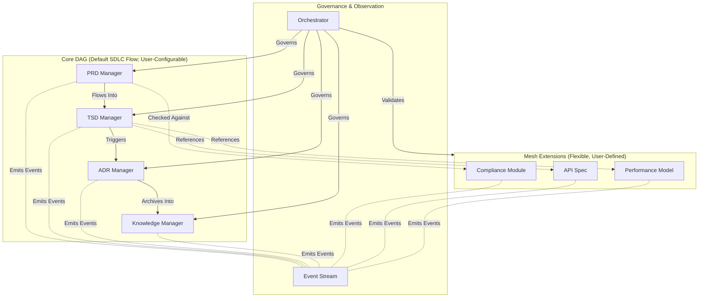

## 1. Context
The SDLC_IDE platform requires a multi-agent architecture capable of safely managing all SDLC artifacts. While the system must provide a deterministic and auditable canonical SDLC pipeline, teams must also be able to define custom workflows, custom document types, and semantic extension relationships.

The architecture must satisfy:
*   Strict communication boundaries between core document managers
*   Deterministic, reproducible, auditable lifecycle transitions
*   Custom workflows that remain safe, type-checked, and acyclic
*   Extensible schemas and user-defined artifact types
*   AI-assisted analysis via embeddings and event-layer signals
*   Central governance via an Orchestrator enforcing structural, policy, and security rules

### Core Constraints
*   The Core DAG is always acyclic.
*   Default canonical pipeline: PRD → TSD → ADR → KB.
*   Custom pipelines may be registered via the Workflow Registry.
*   No extension may alter or introduce cycles into the Core DAG.
*   Agent communication must uphold:
    *   Determinism
    *   Predictability
    *   Security
    *   Zero implicit propagation

### Architectural Question
How can SDLC_IDE maintain strict, auditable SDLC governance while still allowing teams to define flexible, domain-specific workflows and semantic extensions?

**Conclusion:** Adopt a Hybrid Directed Graph Architecture.

## 2. Decision
SDLC_IDE will adopt a Hybrid Directed Graph Architecture composed of four coordinated layers:
*   **Core Directed Acyclic Graph (DAG)**
    Authoritative lifecycle; includes the default pipeline and validated custom pipelines.
*   **Mesh Extension Layer**
    Flexible semantic graph supporting many-to-many relationships, domain-specific artifacts, and custom types.
*   **Event-Based Observer Layer**
    Append-only event system powering analytics, ML, embeddings, and operational insight.
*   **Central Orchestrator**
    Governs all graph mutations, enforces lifecycle and policy constraints, validates workflows, and ensures global safety.

## 3. High-Level Architecture Diagram

The default SDLC flow is PRD → TSD → ADR → KB, with full support for validated, user-defined alternatives.

## 4. Core DAG (Authoritative, Acyclic)
The Core DAG encodes the SDLC workflow and serves as the structural backbone of SDLC_IDE.

### Invariants
*   Always acyclic
*   No lateral gossip or implicit propagation
*   Explicit transitions only
*   All graph mutations pass through the Orchestrator
*   Deterministic, predictable evolution
*   Fully auditable lineage

### Default Pipeline
PRD → TSD → ADR → KB

### Custom Pipelines
Teams may register alternative workflows via the Workflow Registry (Appendix A).
The Orchestrator enforces:
*   Acyclicity (topological validation)
*   Type Safety (valid artifact types)
*   Permissions / ACLs (via OPA)
*   Backward Compatibility (no stranded or invalidated artifacts)
*   Deterministic transition semantics

The Core DAG is the authoritative structure for all lifecycle governance.

## 5. Mesh Extension Layer (Flexible, User-Defined)
The Mesh Extension Layer provides semantic flexibility without compromising lifecycle safety.

### Supports
*   Custom document types
*   Custom schemas
*   Many-to-many semantic edges
*   Domain-specific modules (Compliance, API Specs, Performance Models)
*   Analytical or supporting artifacts

### Mesh Guarantees
*   Cycles permitted only within Mesh nodes
*   Mesh may reference Core nodes, but Core never depends on Mesh
*   Mesh may not alter Core structure or workflow
*   All edges validated by the Orchestrator (formalized in ADR-004)

## 6. Event-Based Observer Layer
The Event Layer is an immutable, append-only, observational subsystem capturing:
*   Document lifecycle events
*   Version updates
*   Workflow definitions & changes
*   Policy evaluations
*   Embedding recalculations
*   Agent-to-agent communication

### Event Layer Guarantees
*   Cannot alter Core DAG or Mesh topology
*   Purely observational
*   Supports analytics, ML recommendations, semantic search, personalization, and governance dashboards
*   Represents behavior, not structure

## 7. Rationale
A pure DAG is overly restrictive; a pure mesh is unsafe for SDLC governance.

| Requirement          | DAG      | Mesh  | Hybrid |
|----------------------|----------|-------|--------|
| Strict SDLC Flow     | ✔️       | ✖️    | ✔️     |
| Extensibility        | ✖️       | ✔️    | ✔️     |
| Predictability       | ✔️       | ✖️    | ✔️     |
| Semantic Linking     | Limited  | ✔️    | ✔️     |
| Policy Enforcement   | ✔️       | Risky | ✔️     |

The Hybrid model uniquely balances governance, predictability, and extensibility.

## 8. Consequences
### Positive
*   Strong lifecycle governance
*   Deterministic SDLC flow
*   Safe, validated custom workflows
*   Rich semantic extensibility
*   Clear separation of structure (DAG) vs. behavior (events) vs. semantics (mesh)

### Negative
*   Increased Orchestrator complexity
*   Mesh nodes require schema definitions
*   UI must clearly visualize DAG vs. Mesh

### Tradeoffs
All structural mutations route through the Orchestrator—improving correctness while increasing implementation complexity.

## 9. Alternatives Considered
*   **❌ Full DAG Only**
    Too rigid; cannot support semantic relationships.
*   **❌ Full Mesh Only**
    Unsafe for regulated SDLC governance; prone to cycles and fragmentation.
*   **❌ Hub-and-Spoke**
    Orchestrator becomes bottleneck; insufficient semantic expressivity.

## 10. Decision Outcome
Accepted.

SDLC_IDE will implement:
*   **Core DAG** — strict, acyclic, default + custom workflows
*   **Mesh Extension Layer** — flexible semantic graph
*   **Event Observer Layer** — analytics & ML
*   **Orchestrator** — global governance & policy enforcement

This ADR defines the foundational architectural principles of the SDLC_IDE platform.

## Appendix A — Custom Workflow Registration & Enforcement
### Summary
The system ships with a default canonical pipeline (PRD → TSD → ADR → KB). Teams may define custom workflows via the declarative Workflow Registry. The Orchestrator validates all workflows before activation.

### Workflow Registration File
*   **Location:**
    `.sdlc_ide/workflows/<workflow-id>.yaml`
*   **Required fields:**
    *   id
    *   version
    *   author
    *   status (draft | active | deprecated)
    *   scope
    *   nodes
    *   edges
*   **Optional:** migration metadata

### Validation Rules
Orchestrator enforces:
*   Acyclicity (topological validation)
*   Type Safety (valid artifact types)
*   Permission & ACL checks (OPA)
*   Backward Compatibility:
    *   No existing artifacts may enter invalid states
    *   Migrations must be explicit, versioned, and safe

### Activation Lifecycle
1.  Contributor submits PR with workflow file
2.  CI validates structure, semantics, and OPA rules
3.  On merge, Orchestrator performs final validation
4.  Workflow status set to active
5.  Activation event written to Event Stream

This provides full regulatory traceability for workflow governance.
