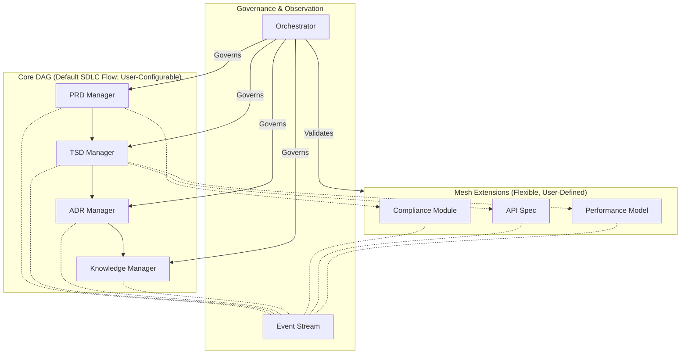
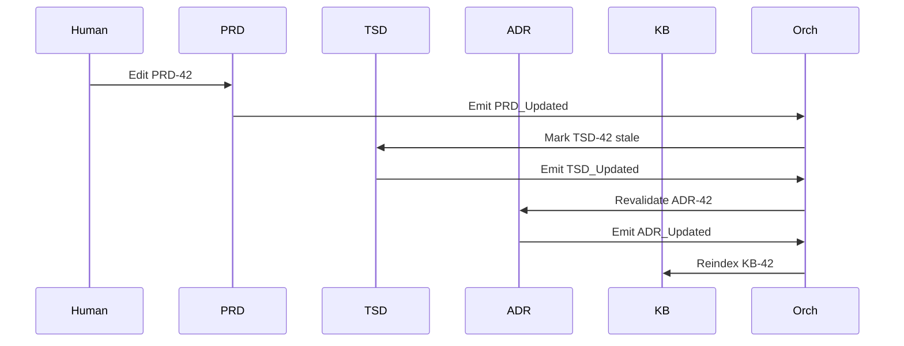

## 1. Context

The SDLC_IDE platform requires a multi-agent architecture capable of managing all documentation types across the SDLC lifecycle while maintaining strict structural guarantees. The system must:

*   Enforce strict communication boundaries between core document managers.
*   Maintain deterministic and auditable lifecycle transitions.
*   Support user-defined document types without compromising core flow.
*   Support AI-driven analytics, vector embeddings, and event-based observability.
*   Provide safe extensibility without risk to DAG integrity.

### Key Constraints

#### Document & Communication

*   PRD remains human-authored and human-centric.
*   TSD must be machine-readable and formally validated.
*   Core document agents follow strict downstream direction: **PRD → TSD → ADR → KB**.
*   No cycles allowed in the core flow.
*   Communication must be deterministic, explicit, and validated.
*   Core document flow is a one-directional, acyclic pipeline.

#### Extensibility

*   Custom document types and custom agents must be supported.
*   Extensions must not: introduce cycles, mutate core documents, or bypass orchestrator rules.
*   All extensions must declare schema, edges, and lineage explicitly.
*   Extensions follow a declarative model and cannot corrupt the core lifecycle.

#### Observability & State

*   All state changes must be emitted as immutable events (ADR-002).
*   Embeddings (ADR-003) cannot override structural rules.
*   Persistent workspace (ADR-004) must preserve DAG semantics and enforce DAG constraints.

### Key Design Questions

*   How to integrate custom document types without breaking the strict SDLC pipeline?
*   How to maximize extensibility while maintaining governance?
*   How to prevent unauthorized agent communication or cycles?
*   How to validate mesh behavior without centralizing all logic?

---

## 2. Decision

SDLC_IDE adopts a **Hybrid Directed Graph Architecture** with three layers:

### A. Core Strict Directed Acyclic Graph (DAG)

Defines the authoritative SDLC lifecycle: **PRD Manager → TSD Manager → ADR Manager → KB Manager**.

**Properties**:

*   No cycles permitted; enforced by Orchestrator (ADR-005).
*   Deterministic propagation.
*   Strict downstream-only communication between agents.
*   No gossip or peer-to-peer chatter.
*   Fully governed by Orchestrator state machine.
*   Perfect traceability of updates.

#### Core Agents and Flow Summary

| Agent/Stage     | Responsibilities/Description                                                                    | Trigger       | Output        |
| --------------- | ----------------------------------------------------------------------------------------------- | ------------- | ------------- |
| **PRD Manager** | Accepts human-authored PRDs; publishes `PRD_Updated`; stores in versioned workspace.            | Human update  | `PRD_Updated` |
| **TSD Manager** | Triggered by PRD updates; validates TSD; publishes `TSD_Updated`; stores TSD.                   | `PRD_Updated` | `TSD_Updated` |
| **ADR Manager** | Triggered by TSD updates; validates ADR; publishes `ADR_Updated`; stores ADR.                   | `TSD_Updated` | `ADR_Updated` |
| **KB Manager**  | Triggered by ADR updates; indexes artifacts; publishes `KB_Updated`; manages long-term storage. | `ADR_Updated` | `KB_Updated`  |

---

### B. Selective Mesh Layer (Extensions)

Supports custom document types and additional workflows.

**Characteristics**:

*   User-defined document schemas and relations.
*   All custom document types must declare: Schema (JSON Schema), Allowed inbound/outbound edges, Embedding strategy, Lifecycle state (mesh-only).
*   Mesh edges **must not**: create cycles, mutate or override DAG documents, bypass orchestrator validation.
*   Orthogonal to the Core DAG; strictly validated by the Orchestrator.
*   Optional gossip is permitted within isolated mesh clusters but can never influence the Core DAG.

**Gossip Rules**:

*   Allowed **only** in isolated mesh clusters.
*   Forbidden in the Core DAG.

**Embedding Rules (ADR-003)**:

*   Semantic links are informational only.
*   Structural rules are authoritative and cannot be overridden.

**Example Extension (ArchitectureDiagram)**:

```yaml
type: ArchitectureDiagram
schema: diagram.schema.json
inbound_edges: ["ADR"]
outbound_edges: []
embedding_strategy: structural+image
lifecycle: mesh
```

---

### C. Event-Based Observer Layer

Immutable, append-only event stream per ADR-002.

**Captures**:

*   Lifecycle changes.
*   Agent-to-agent calls.
*   User edits.
*   Merge/rollback events.
*   Embedding updates.
*   Validation failures and policy violations.

**Properties**:

*   Observational only—cannot mutate state.
*   Immutable.
*   Schematized for backward compatibility.

---

## 3. High-Level Architecture Diagram



---

## 4. Rationale

### Why a Core DAG?

*   Aligns naturally with SDLC process flow.
*   Enforces upstream-downstream correctness.
*   Eliminates invalid reverse mutations.
*   Enables compliance-grade audit trails.
*   Prevents noisy or unauthorized communication.
*   Ensures deterministic and reproducible runs.

### Why a Mesh?

*   Supports custom document types and flexible linking.
*   Allows semantic, lateral, and contextual relationships.
*   Supports domain-specific extensions without modifying the core.
*   Embeddings allow powerful discovery and analytics.

### Why Hybrid?

| Requirement               | DAG Only | Mesh Only | Hybrid |
| ------------------------- | -------- | --------- | ------ |
| Strict SDLC flow          | ✅        | ❌         | ✅      |
| Extensibility             | ❌        | ✅         | ✅      |
| Predictability            | ✅        | ❌         | ✅      |
| Semantic links            | Limited  | ✅         | ✅      |
| Governance                | Strong   | Weak      | Strong |
| Auditability              | ✅        | ❌         | ✅      |
| Performance / Scalability | ✅        | ✅         | ✅      |

---

## 5. Consequences

### Positive

*   Strong governance through Orchestrator and Governor.
*   Deterministic SDLC lifecycle.
*   Extensions safely integrated through validated mesh topology.
*   Clean visual separation of core DAG vs. mesh.
*   Efficient cycle detection.
*   Perfect traceability via version-controlled workspace.
*   Semantic inference is powerful but safely constrained.

### Negative

*   Increased implementation complexity.
*   All custom types require schemas and edge definitions.
*   Higher governance burden for teams adding new document types.
*   Potential policy conflicts if OPA/Rego rules are misconfigured.

### Neutral / Tradeoffs

*   Extensions are powerful but not freeform.
*   All topology changes require orchestrator approval.
*   Gossip allowed only in mesh clusters, never in the core.
*   Increased Orchestrator complexity (cycle detection, mesh validation, policy enforcement).

---

## 6. Alternatives Considered

### A. Full DAG Only

Rejected: too rigid; poor support for semantic/lateral links; cannot support custom workflows.

### B. Full Mesh Only

Rejected: lifecycle not enforceable; high risk of cycles; non-deterministic; compliance impossible.

### C. Hub-and-Spoke

Rejected: orchestrator bottleneck; poor scalability; incompatible with flexible mesh topology.

---

## 7. Decision Outcome

**Accepted.** SDLC_IDE will implement the Hybrid Directed Graph Architecture with:

*   Core strict DAG
*   Selective and validated mesh
*   Immutable event layer
*   Unified workspace persistence

This ADR forms the foundation for subsequent ADRs and TSDs.

---

## 8. Dependencies & Cross-References

### Depends On

*   None (Foundational ADR)

### Depended By

*   ADR-002: Event Streaming
*   ADR-003: Vectorization
*   ADR-004: Persistence
*   ADR-005: Orchestrator
*   ADR-006: Custom Document Integration
*   ADR-007: Failure Modes
*   ADR-009: Core System Agents

### Required Updates to Other ADRs

| ADR     | Update Needed                     | Details                                                                                   | Status  |
| ------- | --------------------------------- | ----------------------------------------------------------------------------------------- | ------- |
| ADR-002 | Ordering guarantees               | Partition by `artifact_id`; causal ordering via `Dependency_Evaluated` events             | Pending |
| ADR-003 | Structural embeddings             | Must defer to orchestrator validation; semantic inference is separate                     | Pending |
| ADR-004 | DAG enforcement                   | Workspace structure must reflect core/mesh topology; writes enforced by Orchestrator      | Pending |
| ADR-005 | Cycle detection & Mesh validation | Must implement algorithms to validate mesh topology and enforce declared rules; ACL model | Pending |
| ADR-006 | Extension integration             | Custom types must declare schema, edges, embedding strategy                               | Pending |
| ADR-007 | Failure handling                  | Align with mesh and event layer                                                           | Pending |

---

## 9. Implementation Notes

### For ADR-005 Orchestrator

*   Core state machine
*   Mesh cycle detection
*   Mesh edge validation
*   Atomic transactional writes (ADR-004)
*   Event consumption (observational)

### For ADR-004 Persistence

*   Store core docs in `.sdlc_ide/core/`, extensions in `.sdlc_ide/extensions/`
*   Enforce orchestrator-mediated writes
*   Support branching, merging, rollback workflows

### For ADR-006 Custom Integration

*   Declare schema, edges, embedding strategy
*   Pass orchestrator validation
*   Publish events to event stream

---

## 10. Open Questions

| Question              | Answered In       | Status  | Owner / Next Step |
| --------------------- | ----------------- | ------- | ----------------- |
| Mesh edge validation  | ADR-005           | Pending | Engineering       |
| ACL model             | ADR-005 / ADR-006 | Pending | Engineering       |
| Agent persistence     | ADR-004           | Pending | Engineering       |
| Transaction model     | ADR-004 / ADR-005 | Pending | Engineering       |
| Extension integration | ADR-006           | Pending | Engineering       |
| Failure handling      | ADR-007           | Pending | Engineering       |

---

## 11. Glossary

| Term             | Definition                                                                             |
| ---------------- | -------------------------------------------------------------------------------------- |
| **DAG**          | Directed Acyclic Graph defining core SDLC flow.                                        |
| **Mesh**         | Extension layer for custom document types; orthogonal to the core DAG.                 |
| **Orchestrator** | Enforces communication and state transitions (ADR-005).                                |
| **Governor**     | OPA/Rego policy engine enforcing compliance rules (ADR-005).                           |
| **Embedding**    | Vectorized semantic representation, enabling semantic linking (ADR-003).               |
| **Event**        | Immutable record of a state change, published to the event stream (ADR-002).           |
| **Workspace**    | Version-controlled directory (`.sdlc_ide/`) storing all artifacts and state (ADR-004). |
| **Gossip**       | Peer-to-peer messaging allowed only in mesh clusters; not allowed in the core DAG.     |

---

## 12. Appendix: Example DAG State Transition

**Human edits PRD-42**:

1.  `PRD_Updated` emitted.
2.  Orchestrator marks TSD-42 as stale/pending_sync.
3.  TSD Manager regenerates/validates TSD-42.
4.  Orchestrator emits `TSD_Updated`.
5.  ADR Manager revalidates ADR-42.
6.  Orchestrator emits `ADR_Updated`.
7.  KB Manager reindexes.
8.  Final state is consistent: **PRD-42 → TSD-42 → ADR-42 → KB-42**.

**Mermaid Sequence Diagram (Optional Visualization)**:



---

## 13. References

*   ADR-002: Event Streaming Layer
*   ADR-003: Vectorization & Embedding Strategy
*   ADR-004: Unified Memory & Persistence Layer
*   ADR-005: Orchestrator & Governor Architecture
*   ADR-006: Custom Document Type Integration
*   ADR-007: Failure Modes & Degradation
*   ADR-009: Core System Agents
