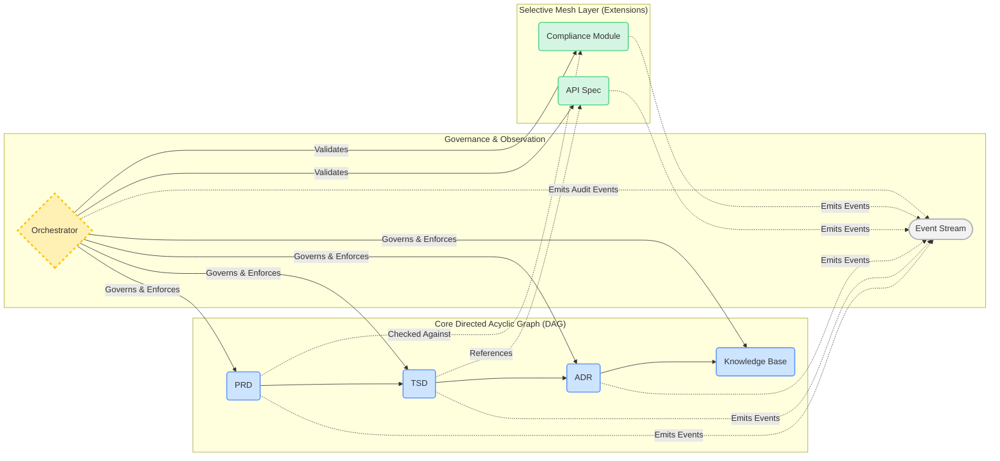

## 1. Context
SDLC_IDE requires a multi-agent architecture that manages all document types across the SDLC lifecycle, enforces strict communication boundaries, maintains deterministic and auditable lifecycle transitions, and allows for safe, user-defined extensibility. The system must support AI-driven analytics, vector embeddings, and event-based observations while preserving structural integrity.

### Key Constraints
*   **Document & Communication:** The core document flow (`PRD → TSD → ADR → KB`) is a one-directional, acyclic pipeline. Communication rules must be enforceable, secure, and deterministic.
*   **Extensibility:** The system must support extensions (custom document types, agents, relations) which must follow a declarative model and are forbidden from introducing cycles or corrupting the core lifecycle.
*   **Observability & State:** All state changes must be auditable via immutable event streams (ADR-002), and the persistent workspace (ADR-004) must enforce DAG semantics.

### Key Design Questions
1.  How do custom document types integrate without breaking structure?
2.  How do we maintain strict control while enabling extensibility?
3.  How do agents coordinate without unauthorized propagation?
4.  How is mesh validation enforced without centralizing all logic?

---

## 2. Decision
We will adopt a **Hybrid Directed Graph Architecture** with three integrated layers:

### A. Core Directed Acyclic Graph (DAG)
The authoritative SDLC lifecycle, flowing `PRD → TSD → ADR → KB`.
*   **Properties:** No cycles, deterministic propagation, enforced communication boundaries, no gossip traffic, and fully governed by the Orchestrator (ADR-005).

**Core Agents:**
| Agent           | Responsibilities                                                                                |
| --------------- | ----------------------------------------------------------------------------------------------- |
| **PRD Manager** | Accepts human-authored PRDs; publishes `PRD_Updated`; stores in versioned workspace.            |
| **TSD Manager** | Triggered by PRD updates; validates TSD; publishes `TSD_Updated`; stores TSD.                   |
| **ADR Manager** | Triggered by TSD updates; validates ADR; publishes `ADR_Updated`; stores ADR.                   |
| **KB Manager**  | Triggered by ADR updates; indexes artifacts; publishes `KB_Updated`; manages long-term storage. |

### B. Selective Mesh Layer (Extensions)
Supports user-defined document types and custom workflows safely.
*   **Characteristics:** Requires explicit declaration for each custom type (schema, allowed edges, etc.), is orthogonal to the Core DAG, and is strictly validated by the Orchestrator. Optional gossip is permitted within isolated mesh clusters but can never influence the Core DAG. Semantic linking via embeddings (ADR-003) is informational only.

**Example Mesh Declaration:**
```json
{
  "type": "ArchitectureDiagram",
  "schema": "diagram.schema.json",
  "inbound_edges": ["ADR"],
  "outbound_edges": [],
  "embedding_strategy": "structural + image",
  "lifecycle": "mesh"
}
```

### C. Event-Based Observer Layer
An immutable, append-only event stream (e.g., Kafka, per ADR-002) that captures all system activity for observability, analytics, and auditing. Events are strictly observational and are not authoritative for state changes.

---

## 3. High-Level Architecture Diagram


---

## 4. Rationale
| Requirement         | DAG Only | Mesh Only | Hybrid |
| ------------------- | -------- | --------- | ------ |
| Strict SDLC flow    | ✅        | ❌         | ✅      |
| Extensibility       | ❌        | ✅         | ✅      |
| Predictability      | ✅        | ❌         | ✅      |
| Semantic relations  | Limited  | ✅         | ✅      |
| Safety & governance | ✅        | ❌ Risky   | ✅      |
| Auditability        | ✅        | ❌         | ✅      |

The Hybrid model uniquely balances governance, predictability, and extensibility.

---

### Default Pipeline
PRD → TSD → ADR → KB
## 5. Consequences
### Positive
*   Strong governance via Orchestrator (ADR-005).
*   Deterministic, reproducible state transitions.
*   Safe integration of custom document types.
*   Clear separation of concerns: structure (DAG), semantics (Mesh), and behavior (Events).
*   Fully auditable and traceable workspace (ADR-004).

### Negative / Tradeoffs
*   Increased Orchestrator complexity (cycle detection, mesh validation, policy enforcement).
*   Requires explicit schema and ACL declarations for all mesh extensions.
*   Graph changes require orchestrator approval; dynamic mutations are disallowed.

---

## 6. Alternatives Considered
*   **Full DAG Only:** Rejected. Too rigid; cannot support many-to-many semantic links or user-defined document types.
*   **Full Mesh Only:** Rejected. Unsafe for SDLC governance; lacks deterministic lineage and is prone to chaos.
*   **Hub-and-Spoke:** Rejected. Creates a central bottleneck and lacks the expressiveness needed for semantic modeling.

---

## 7. Decision Outcome
**Accepted.** SDLC_IDE will implement the Hybrid Directed Graph Architecture. This ADR is the foundational document for all subsequent TSDs and system diagrams.

---

## 8. Dependencies & Cross-References
**Depends On:** None (foundational)

**Depended By:**
*   ADR-002 (Event Streaming)
*   ADR-003 (Vectorization)
*   ADR-004 (Persistence)
*   ADR-005 (Orchestrator)
*   ADR-006 (Custom Integration)

**Required Updates to Other ADRs:**
| ADR             | Update Needed                 | Details                                                                    |
|-----------------|-------------------------------|----------------------------------------------------------------------------|
| ADR-002         | Ordering guarantees           | Partition by `artifact_id`; causal ordering via `Dependency_Evaluated` events|
| ADR-003         | Structural embeddings         | Must defer to orchestrator validation; semantic inference is separate      |
| ADR-004         | DAG enforcement               | Workspace structure must reflect core/mesh topology; writes enforced by Orchestrator |
| ADR-005         | Cycle detection & Mesh validation| Must implement algorithms to validate mesh topology and enforce declared rules |

---

## 9. Implementation Notes
*   **Orchestrator (ADR-005):** Must implement the core agent state machine, mesh validation (cycle detection, edge rules), and an atomic transaction model for writes.
*   **Workspace (ADR-004):** Core artifacts will be stored in `.sdlc_ide/core/`, with mesh extensions in `.sdlc_ide/extensions/`.
*   **Custom Integration (ADR-006):** Custom types must declare their schema, edges, and embedding strategy, and must pass orchestrator validation.

---

## 10. Glossary
| Term         | Definition                                                               |
| ------------ | ------------------------------------------------------------------------ |
| DAG          | Directed Acyclic Graph; the core SDLC flow with no cycles.               |
| Mesh         | The extension layer for custom document types; orthogonal to the core DAG. |
| Orchestrator | The central service enforcing communication rules, state transitions, and policy (ADR-005). |
| Governor     | The policy engine (using OPA/Rego) that enforces compliance rules (ADR-005). |
| Embedding    | A vector representation of document semantics, enabling semantic linking (ADR-003). |
| Event        | An immutable record of a state change, published to the event stream for observation (ADR-002). |
| Workspace    | The version-controlled directory (`.sdlc_ide/`) storing all artifacts and state (ADR-004). |
| Gossip       | Peer-to-peer communication within mesh clusters; not allowed in the core DAG. |

---

## 11. Appendix: Example DAG State Transition
1.  **Initial State:** `PRD-42` ("Build payments microservice") exists. Downstream documents are not yet generated.
2.  **Event:** A human updates `PRD-42`.
3.  **Orchestrator:** Receives the `PRD_Updated` event, validates it, and marks the downstream `TSD-42` as `pending_sync`.
4.  **Orchestrator:** Notifies the TSD Manager to re-validate `TSD-42` against the new `PRD-42`.
5.  **TSD Manager:** Runs its validation logic and updates `TSD-42`.
6.  **Orchestrator:** Publishes the `TSD_Updated` event.
7.  **Orchestrator:** Cascades the process by marking `ADR-42` as `pending_sync`, and the flow continues until all documents in the chain are consistent.

---

## 12. References
*   ADR-002: Event Streaming Layer
*   ADR-003: Vectorization & Embedding Strategy
*   ADR-004: Unified Memory & Persistence Layer
*   ADR-005: Orchestrator & Governor Architecture
*   ADR-006: Custom Document Type Integration
*   ADR-007: Failure Modes & Degradation
*   ADR-009: Core System Agents
