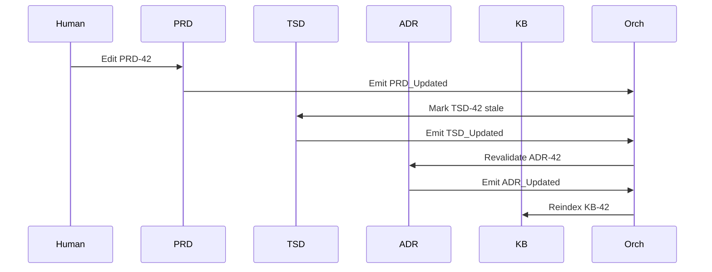

## 1. Context

The SDLC_IDE platform requires a multi-agent architecture capable of managing heterogeneous documentation types across the SDLC lifecycle while maintaining strict structural guarantees. The architecture must support:

*   Clear upstream → downstream communication boundaries between core document managers
*   Deterministic and auditable lifecycle transitions
*   User-defined extensions without compromising core SDLC integrity
*   AI-driven analytics (embeddings, semantic search, clustering)
*   Immutable observability of all state changes
*   A safe, governed environment for extensibility

### Key Constraints

#### Document & Communication

*   PRD remains human-authored and human-centric.
*   TSD must be machine-readable, validated, and generated deterministically.
*   Core managers follow strict flow: **PRD → TSD → ADR → KB**.
*   No cycles allowed in core flow.
*   Communication between agents must be deterministic, explicit, and centrally validated.

#### Extensibility

*   Custom document types and custom agents must be supported.
*   Extensions must not introduce cycles or mutate core documents.
*   All extensions must declare:
    *   Schema (JSON Schema)
    *   Allowed edges
    *   Embedding strategy
    *   Lifecycle state
*   Extensions must pass Orchestrator + Governor validation.

#### Observability & State

*   All state changes must be emitted as immutable events (ADR-002).
*   Embeddings (ADR-003) influence semantic navigation only; they cannot override structural rules.
*   Workspace persistence (ADR-004) must enforce DAG semantics across reloads and branching.

### Key Design Questions

*   How can custom document types plug in without breaking the SDLC pipeline?
*   How do we allow flexibility (mesh) while maintaining strong governance?
*   How do we prevent unauthorized communication or topology violations?
*   How can mesh validation be decentralized without centralizing all logic?

---

## 2. Decision

SDLC_IDE adopts a **Hybrid Directed Graph Architecture** with three integrated layers:

---

### A. Core Strict Directed Acyclic Graph (DAG)

Defines the authoritative SDLC lifecycle:
**PRD Manager → TSD Manager → ADR Manager → KB Manager**

#### Properties

*   No cycles — enforced by Orchestrator (ADR-005).
*   Deterministic propagation.
*   Agents communicate only downstream.
*   No gossip or opportunistic peer messaging.
*   Governed by a precise Orchestrator state machine.
*   The Orchestrator MUST reject all mutations to Core system behavior, topology, or governance rules not originating from a human-approved ADR.
*   Full auditability and reproducibility.

#### Core Agents and Flow Summary

| Agent           | Responsibilities                                                                      | Trigger       | Output        |
| --------------- | ------------------------------------------------------------------------------------- | ------------- | ------------- |
| **PRD Manager** | Accepts human-authored PRDs, stores version-controlled artifacts, emits `PRD_Updated` | Human edit    | `PRD_Updated` |
| **TSD Manager** | Generates/validates TSD from PRD, ensures consistency, emits `TSD_Updated`            | `PRD_Updated` | `TSD_Updated` |
| **ADR Manager** | Validates architectural decisions vs TSD, emits `ADR_Updated`                         | `TSD_Updated` | `ADR_Updated` |
| **KB Manager**  | Indexes artifacts, updates semantic/structural knowledge views, emits `KB_Updated`    | `ADR_Updated` | `KB_Updated`  |

---

### B. Selective Mesh Layer (Extensions)

Supports custom document types, semantic relations, and lateral workflows.

#### Characteristics

*   Completely user-defined document schemas.
*   All custom document types declare:
    *   Schema
    *   Inbound/outbound edges
    *   Embedding strategy
    *   Lifecycle state
*   Mesh edges may connect to core or mesh, but **never mutate core nodes**.
*   Orchestrator validates structural rules; Governor enforces policies.

#### Gossip Rules

*   Allowed only within isolated mesh clusters.
*   Forbidden in core DAG.
*   Mesh gossip cannot influence or update core state.

#### Embedding Rules

*   Embeddings create **semantic**, not structural, links.
*   All embeddings must defer to Orchestrator for lifecycle decisions.

#### Example Mesh Extension

```yaml
type: ArchitectureDiagram
schema: diagram.schema.json
inbound_edges: ["ADR"]
outbound_edges: []
embedding_strategy: structural+image
lifecycle: mesh
```

---

## **B.1 Self-Proposing Extensions Architecture (Hybrid Orchestrator + Governor Model)**

**SDLC_IDE supports dynamic, autonomous system extension exclusively through the Mesh layer. The system may discover needs, generate extension proposals, validate them structurally through the Orchestrator, enforce safety and compliance through the Governor (OPA/Rego), and register new Mesh types automatically. The Core DAG remains immutable and cannot be altered by autonomous agents; any modification to the Core flow requires explicit human approval via the ADR governance process.**

### **Autonomous Extension Pipeline**

1. **Discovery**
   Agents identify repeated patterns, missing document concepts, or emerging structural needs.

2. **Proposal Generation**
   A Mesh Extension Spec (MES) is generated containing:

   * schema
   * allowed edges
   * lifecycle state
   * embedding strategy
   * intended semantics

3. **Orchestrator Validation (Structural)**

   * cycle detection
   * topology rules
   * core boundary protection
   * lifecycle/schema invariants
   * safe edge semantics

4. **Governor Validation (Policy / ACL)**

   * access control
   * compliance rules
   * semantic policy restrictions
   * cross-domain constraints

5. **Registration**
   If both validations succeed:

   * new Mesh type becomes available at runtime
   * embeddings and indexing initialized
   * events emitted for full auditability

### **Constraints**

* Extensions **must not mutate or override Core DAG rules**.
* Extensions **must not introduce cycles**.
* Extensions **must pass both structural and policy validation**.
* Mesh gossip **must not influence core agent lifecycles**.
* All extension proposals, approvals, and rejections **must be emitted as immutable events**.

---
### C. Event-Based Observer Layer

Immutable, append-only event stream per ADR-002.

#### Captures

*   All lifecycle transitions
*   All agent-to-agent interactions
*   All user edits
*   All merges / rollback operations
*   Embedding updates
*   Validation failures / policy violations

#### Properties

*   Immutable
*   Schematized
*   Observational only (never authoritative)
*   Foundation for analytics, search, and replay

---

## 3. High-Level Architecture Diagram

```mermaid
graph TD
subgraph CoreDAG ["Core DAG (Authoritative SDLC Pipeline)"]
    direction TB
    PRD[PRD Manager] --> TSD[TSD Manager]
    TSD --> ADR[ADR Manager]
    ADR --> KB[Knowledge Manager]
end

subgraph Mesh ["Mesh Extensions (Flexible, User-Defined)"]
    direction TB
    Comp[Compliance Module]
    API[API Spec]
    Perf[Performance Model]
end

subgraph Gov ["Governance & Observation"]
    Orch[Orchestrator]
    Govr[Governor (OPA/Rego)]
    Events[Event Stream]
end

TSD -.-> API
TSD -.-> Perf
PRD -.-> Comp

Orch -- Governs --> PRD
Orch -- Governs --> TSD
Orch -- Governs --> ADR
Orch -- Governs --> KB
Orch -- Validates --> Mesh

Govr -- ACL/Policy --> Orch
Govr -- ACL/Policy --> Mesh

PRD -.- Events
TSD -.- Events
ADR -.- Events
KB -.- Events
Comp -.- Events
API -.- Events
Perf -.- Events
```

---

## 4. Rationale

### Why a Core DAG?

*   Natural fit for SDLC workflows.
*   Prevents backward mutations and ensures alignment.
*   Guarantees deterministic, auditable state transitions.
*   Enables reproducible builds and compliance.

### Why a Mesh?

*   Supports unbounded extensibility.
*   Enables semantic, contextual, and lateral relationships.
*   Preserves strict separation from core DAG.
*   Allows AI-driven discovery without structural compromise.

### Why Hybrid?

| Requirement         | DAG Only | Mesh Only | Hybrid |
| ------------------- | -------- | --------- | ------ |
| Strict SDLC flow    | ✅        | ❌         | ✅      |
| Extensibility       | ❌        | ✅         | ✅      |
| Predictability      | ✅        | ❌         | ✅      |
| Semantic links      | Limited  | ✅         | ✅      |
| Governance strength | Strong   | Weak      | Strong |
| Auditability        | High     | Low       | High   |

The hybrid approach is the only one that supports both **formal lifecycle guarantees** and **flexible extensibility**.

---

## 5. Consequences

### Positive

*   Deterministic SDLC lifecycle.
*   Strong governance (Orchestrator + Governor).
*   Safe extensibility through declarative mesh topology.
*   Perfect traceability via event logs and versioned workspace.
*   Clear separation of authoritative vs semantic relationships.

### Negative

*   Increased complexity in orchestration.
*   All extensions require schema + edge definitions.
*   Higher governance overhead for policy management (OPA/Rego).

### Neutral / Trade-offs

*   Extensions are powerful but not freeform.
*   All topology changes require Orchestrator approval.
*   Gossip is allowed only within mesh.
*   Orchestrator must support cycle detection, policy execution, and transactional writes.

---

## 6. Alternatives Considered

### A. Full DAG

Rejected — too rigid, lacks semantic flexibility.

### B. Full Mesh

Rejected — nondeterministic, unsafe, ungovernable.

### C. Hub-and-Spoke

Rejected — orchestrator bottleneck, loses mesh expressiveness.

---

## 7. Decision Outcome

**Accepted.**
SDLC_IDE will implement:

*   Core strict DAG
*   Selective mesh layer
*   Immutable observational event stream
*   Hybrid governance (Orchestrator + OPA/Rego Governor)

---

## 8. Dependencies & Cross-References

### Depends On

None (Foundational).

### Depended By

*   ADR-002 Event Streaming
*   ADR-003 Vectorization
*   ADR-004 Persistence
*   ADR-005 Orchestrator
*   ADR-006 Custom Document Types
*   ADR-007 Failure Modes
*   ADR-009 Core System Agents

### Required Updates to Other ADRs

| ADR     | Update Needed                                | Status  |
| ------- | -------------------------------------------- | ------- |
| ADR-002 | Ordering guarantees for DAG artifacts        | Pending |
| ADR-003 | Embeddings must defer to Orchestrator        | Pending |
| ADR-004 | Workspace enforces DAG + mesh topology       | Pending |
| ADR-005 | Cycle detection + mesh validation algorithms | Pending |
| ADR-006 | Extension schema + edge declarations         | Pending |
| ADR-007 | Align failure modes with event layer         | Pending |

---

## 9. Implementation Notes

### ADR-005 Orchestrator

Implements:

*   Core state machine
*   Cycle detection
*   Mesh edge validation
*   Transaction boundaries
*   Coordination with Governor
*   Event ingestion (observational)

### ADR-004 Persistence

Workspace must:

*   Separate core from extensions
*   Support branching/merging/rollbacks
*   Allow transactional write enforcement
*   Reflect DAG + mesh topology explicitly

### ADR-006 Extensions

Custom types must:

*   Declare schema, edges, embedding strategy
*   Pass Orchestrator + Governor checks
*   Emit events

---

## 10. Open Questions

| Question             | Answered In       | Status  |
| -------------------- | ----------------- | ------- |
| Mesh edge validation | ADR-005           | Pending |
| ACL model            | ADR-005 / ADR-006 | Pending |
| Transaction model    | ADR-004 / ADR-005 | Pending |
| Failure handling     | ADR-007           | Pending |

---

## 11. Glossary

| Term             | Definition                                             |
| ---------------- | ------------------------------------------------------ |
| **DAG**          | Authoritative SDLC flow with no cycles                 |
| **Mesh**         | Flexible extension layer for user-defined documents    |
| **Orchestrator** | Enforces structural rules and lifecycle transitions    |
| **Governor**     | OPA/Rego engine enforcing ACLs, compliance, and policy |
| **Embedding**    | Vectorized semantic representation (non-authoritative) |
| **Event**        | Immutable observation of system activity               |
| **Workspace**    | Version-controlled repository of artifacts and state   |
| **Gossip**       | Peer-to-peer messaging allowed only within mesh        |

---

## 12. Appendix — Example State Transition

### Human updates PRD-42

1.  `PRD_Updated` emitted
2.  Orchestrator marks TSD-42 pending_sync
3.  TSD regenerates & publishes `TSD_Updated`
4.  Orchestrator revalidates ADR
5.  ADR publishes `ADR_Updated`
6.  KB reindexes
7.  Final state: **PRD-42 → TSD-42 → ADR-42 → KB-42**

### Optional Sequence Diagram


