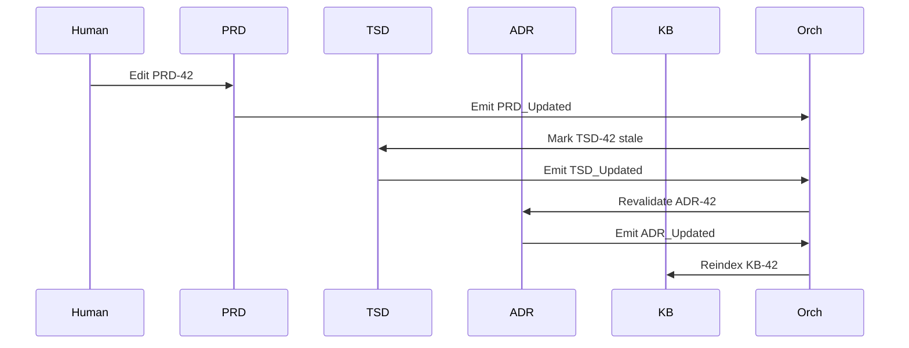

# ADR-001: Hybrid Directed Graph Architecture with Selective Mesh Extensions

**Status:** Accepted
**Date:** 2025-11-27
**Updated:** 2025-11-27
**Project:** SDLC_IDE
**Author:** System Architecture Team

---

## 1. Context

SDLC_IDE requires a multi-agent architecture that:

* Manages all documentation types across the SDLC lifecycle
* Enforces strict communication boundaries between core document managers
* Maintains deterministic and auditable lifecycle transitions
* Allows user-defined document types without breaking core flow
* Supports AI-driven analytics, vector embeddings, and event-based observations
* Enables safe extensibility while preserving structural integrity

### Key Constraints

**Document & Communication:**

* PRD remains human-centric; TSD must be machine-readable
* Core document agents (PRD → TSD → ADR → KB) follow a strict one-way pipeline
* No cycles permitted in core document flow
* Communication rules must be enforceable, secure, and deterministic

**Extensibility:**

* System supports extensions (custom document types, agents, relations)
* Extensions must not introduce cycles or compromise core lifecycle
* Extensions must follow a declarative model with explicit schema, allowed edges, and lineage

**Observability & State:**

* All state changes are auditable via immutable event streams (ADR-002)
* Semantic relationships inferred from embeddings (ADR-003) must not override structural rules
* Persistent workspace (ADR-004) enforces DAG semantics across restarts

### Key Design Questions

* How do custom document types integrate safely?
* How do we maintain strict control while enabling extensibility?
* How do agents coordinate without unnecessary network load or unauthorized propagation?
* How is mesh validation enforced without centralizing all logic?

---

## 2. Decision

Adopt a **Hybrid Directed Graph Architecture** with three layers:

### A. Core Strict Directed Acyclic Graph (DAG)

* Defines communication and dependency flows among core SDLC agents:

**Flow:** PRD → TSD → ADR → KB

**Properties:**

* Acyclic: enforced by Orchestrator (ADR-005)
* Deterministic propagation: ordered, observable state transitions
* Enforced agent communication boundaries: downstream-only calls
* Full alignment with SDLC lifecycle
* No gossip traffic; all coordination explicit through Orchestrator

**Core Agents Responsibilities:**

| Agent       | Responsibilities                                                                                                 |
| ----------- | ---------------------------------------------------------------------------------------------------------------- |
| PRD Manager | Accepts human-authored PRDs; publishes PRD_Updated events (ADR-002); stores PRD in versioned workspace (ADR-004) |
| TSD Manager | Triggered by PRD_Updated; validates TSD consistency; publishes TSD_Updated; stores TSD                           |
| ADR Manager | Triggered by TSD_Updated; validates ADR compliance; publishes ADR_Updated; stores ADR                            |
| KB Manager  | Triggered by ADR_Updated; indexes and links knowledge artifacts; publishes KB_Updated; manages long-term storage |

**Rationale:**

* Natural one-way flow prevents upstream mutations
* Single source of truth for downstream documents
* Enables traceability, compliance, and reproducibility

---

### B. Selective Mesh Layer (Extensions)

* Supports user-defined document types and custom workflows safely

**Mesh Characteristics:**

* Explicit declaration: schema, allowed edges, embedding strategy, lifecycle
* Orthogonal to Core DAG: cannot mutate core artifacts, cannot create cycles, cannot bypass Orchestrator validation
* Optional peer-to-peer gossip **only within approved clusters**
* Semantic linking via embeddings (ADR-003); structural rules always defer to DAG

**Example Mesh Extension:**

```json
{
  "type": "ArchitectureDiagram",
  "schema": "diagram.schema.json",
  "inbound_edges": ["ADR"],
  "outbound_edges": [],
  "embedding_strategy": "structural + image",
  "lifecycle": "mesh"
}
```

**Orchestrator Validation Checks:**

* No cycle creation
* Whitelisted inbound/outbound edges
* Valid embedding strategy
* Approved mesh cluster
* Allow write

---

### C. Event-Based Observer Layer

* Observes all system activity (Kafka/Pulsar/NATS, ADR-002)

**Captured Events:**

* Document lifecycle changes (PRD_Updated, etc.)
* Agent-to-agent communication
* User interactions (edits)
* Version control events (commits, merges, rollbacks)
* Embedding updates
* Policy/compliance violations

**Properties:**

* Observational only (non-authoritative)
* Immutable, append-only
* Schematized and versioned (backward additive)

---

## 3. High-Level Architecture Diagram

```mermaid
graph TD
subgraph CoreDAG ["Core DAG (Authoritative SDLC Pipeline)"]
    direction TB
    PRD[PRD Manager] --> TSD[TSD Manager]
    TSD --> ADR[ADR Manager]
    ADR --> KB[Knowledge Manager]
end

subgraph Mesh ["Mesh Extensions (Flexible, User-Defined)"]
    direction TB
    Comp[Compliance Module]
    API[API Spec]
    Perf[Performance Model]
end

subgraph Gov ["Governance & Observation"]
    Orch[Orchestrator]
    Govr[Governor (OPA/Rego)]
    Events[Event Stream]
end

TSD -.-> API
TSD -.-> Perf
PRD -.-> Comp

Orch -- Governs --> PRD
Orch -- Governs --> TSD
Orch -- Governs --> ADR
Orch -- Governs --> KB
Orch -- Validates --> Mesh

Govr -- ACL/Policy --> Orch
Govr -- ACL/Policy --> Mesh

PRD -.- Events
TSD -.- Events
ADR -.- Events
KB -.- Events
Comp -.- Events
API -.- Events
Perf -.- Events
```

---

## 4. Rationale

| Requirement         | DAG Only | Mesh Only | Hybrid |
| ------------------- | -------- | --------- | ------ |
| Strict SDLC flow    | ✅        | ❌         | ✅      |
| Extensibility       | ❌        | ✅         | ✅      |
| Predictability      | ✅        | ❌         | ✅      |
| Semantic relations  | Limited  | ✅         | ✅      |
| Safety & governance | ✅        | ❌ Risky   | ✅      |
| Auditability        | ✅        | ❌         | ✅      |

* **Hybrid** satisfies all requirements
* DAG ensures deterministic SDLC flow
* Mesh provides safe extensibility and semantic linking

---

## 5. Consequences

**Positive:**

* Strong governance via Orchestrator
* Deterministic workflow (PRD → TSD → ADR → KB)
* Safe extensibility for custom types
* Clear visualization & dependency mapping
* Topological validation prevents cycles
* Embedding-based inference aligns with DAG rules

**Negative:**

* Implementation complexity (cycle detection, mesh validation, policy enforcement)
* Explicit ACL/schema declaration required
* Careful mesh validation needed

**Neutral / Tradeoffs:**

* Extensions are powerful but require declaration
* Graph changes require Orchestrator approval
* Core gossip prohibited; only within mesh clusters

---

## 6. Alternatives Considered

* **Full DAG Only:** Too rigid for custom documents
* **Full Mesh Only:** Cannot enforce lifecycle or prevent cycles
* **Hub-and-Spoke:** Bottleneck and limited extensibility

**Decision:** Hybrid DAG + Mesh + Observability layer

---

## 7. Decision Outcome

* **Accepted.** SDLC_IDE uses Hybrid Directed Graph Architecture:

  * Core DAG: strict, deterministic flow
  * Selective Mesh: declared, validated, governed
  * Event Layer: append-only observability
  * Unified persistence in version-controlled workspace

---

## 8. Dependencies & Cross-References

**Depends On:** None
**Depended By:** ADR-002 → ADR-007

**Required Updates:**

| ADR     | Update Needed                     | Details                                                            |
| ------- | --------------------------------- | ------------------------------------------------------------------ |
| ADR-001 | Mesh validation rules             | Deferred to ADR-005                                                |
| ADR-001 | Explicit ACL semantics            | Deferred to ADR-005 / ADR-006                                      |
| ADR-001 | Gossip scope clarification        | Added; only within mesh clusters                                   |
| ADR-002 | Ordering guarantees               | Partition by artifact_id; causal ordering via Dependency_Evaluated |
| ADR-003 | Structural embeddings             | Must defer to orchestrator + schema validation                     |
| ADR-004 | DAG enforcement                   | Workspace reflects core + mesh; Orchestrator enforces writes       |
| ADR-005 | Cycle detection & mesh validation | Must enforce acyclicity & allowed edges                            |

---

## 9. Implementation Notes

* **ADR-005 (Orchestrator):** core state machine, cycle detection, mesh validation, event consumption, transaction model
* **ADR-004 (Persistence):** store core and mesh artifacts; enforce DAG; branching/merging under governance
* **ADR-006 (Custom Integration):** declare schema, edges, embedding strategy; pass orchestrator validation; integrate into workspace; publish events

---

## 10. Open Questions (Deferred to Dependent ADRs)

| Question                | Addressed In      | Status  |
| ----------------------- | ----------------- | ------- |
| Mesh edge validation    | ADR-005           | Pending |
| ACL model               | ADR-005 & ADR-006 | Pending |
| State persistence       | ADR-004           | Pending |
| Transaction model       | ADR-005 & ADR-004 | Pending |
| Custom type integration | ADR-006           | Pending |
| Failure handling        | ADR-007           | Pending |

---

## 11. Glossary

| Term         | Definition                                           |
| ------------ | ---------------------------------------------------- |
| DAG          | Directed Acyclic Graph; core SDLC flow               |
| Mesh         | Extension layer for custom documents                 |
| Orchestrator | Central service enforcing rules (ADR-005)            |
| Governor     | Policy engine enforcing compliance (ADR-005)         |
| Embedding    | Vector representation for semantic linking (ADR-003) |
| Event        | Immutable record in event stream (ADR-002)           |
| Workspace    | Version-controlled directory (.sdlc_ide/)            |
| Gossip       | P2P communication within mesh clusters only          |

---

## 12. Example DAG State Transition

**Initial State:** PRD-42 “Build payments microservice”
**Event Flow:**

1. Human updates PRD-42
2. Orchestrator receives PRD_Updated event
3. Checks TSD-42; marks as pending_sync
4. TSD Manager re-validates → updates → publishes TSD_Updated
5. ADR Manager re-validates → publishes ADR_Updated
6. KB Manager indexes → publishes KB_Updated

**Final State:** PRD → TSD → ADR → KB consistent

---

## 13. References

* ADR-002: Event Streaming Layer
* ADR-003: Vectorization & Embedding Strategy
* ADR-004: Unified Memory & Persistence Layer
* ADR-005: Orchestrator & Governor Architecture
* ADR-006: Custom Document Type Integration
* ADR-007: Failure Modes & Degradation
* ADR-009: Core System Agents

---

## 12. Appendix — Example State Transition

**Human updates PRD-42**

1. `PRD_Updated` emitted
2. Orchestrator marks TSD-42 pending_sync
3. TSD regenerates → `TSD_Updated`
4. Orchestrator revalidates ADR
5. ADR emits `ADR_Updated`
6. KB reindexes
7. Final state: **PRD-42 → TSD-42 → ADR-42 → KB-42**

### Optional Sequence Diagram


