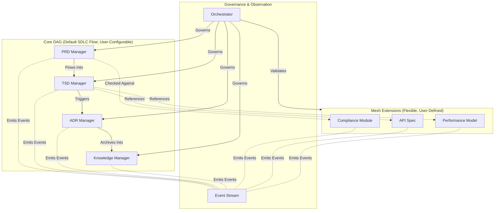

## 1. Context
The SDLC_IDE platform requires a multi‑agent system capable of safely managing all SDLC artifacts.
The platform must support a deterministic, auditable canonical workflow while also enabling user‑defined custom pipelines, custom document types, and semantic extension relationships.
The architecture must satisfy:

*   Strict communication boundaries between core document managers
*   Deterministic, reproducible, auditable lifecycle transitions
*   Custom workflows that remain safe, type‑checked, and acyclic
*   Extensible schemas and custom artifact types
*   AI‑assisted analysis via embeddings and event signals
*   Central governance via an Orchestrator that enforces structural, policy, and security rules

### Core Constraints
*   The Core DAG is always acyclic.
*   Default canonical pipeline: PRD → TSD → ADR → KB
*   Custom pipelines may be registered through the Workflow Registry.
*   No extension may introduce cycles or change the invariants of the Core DAG.
*   Agent communication must ensure:
    *   Determinism
    *   Predictability
    *   Security
    *   Zero implicit propagation

### Architectural Question
How can SDLC_IDE maintain strict, auditable SDLC governance while still allowing teams to define flexible, domain‑specific workflows and semantic extensions?

### Conclusion: Adopt a Hybrid Directed Graph Architecture.

## 2. Decision
SDLC_IDE will adopt a Hybrid Directed Graph Architecture consisting of four coordinated layers:

*   **Core Directed Acyclic Graph (DAG)**
    Authoritative SDLC lifecycle, with a default pipeline and support for validated user-defined custom pipelines.
*   **Mesh Extension Layer**
    Flexible semantic graph supporting many‑to‑many relationships, custom types, and domain-specific artifacts.
*   **Event‑Based Observer Layer**
    Immutable event stream powering analytics, monitoring, ML, personalization, and embeddings.
*   **Central Orchestrator**
    Enforces structural rules, validates workflows, applies policy/security controls, and mediates all graph mutations.

## 3. High-Level Architecture Diagram

The diagram shows the default SDLC lifecycle. The Core DAG is fully configurable via registered custom workflows.

## 4. Core DAG (Authoritative, Acyclic)
The Core DAG encodes the SDLC workflow and is the foundation of all lifecycle governance.
Its invariants:
*   Always acyclic
*   No lateral gossip or implicit propagation
*   Explicit transitions only
*   All structural mutations governed by the Orchestrator
*   Predictable, deterministic evolution
*   Full auditability

### Default Pipeline
PRD → TSD → ADR → KB

### Custom Pipelines
Teams may register alternative validated pipelines via the Workflow Registry (see Appendix A).
The Orchestrator ensures:

*   Acyclicity (topological validation)
*   Valid artifact types
*   Permission & ACL checks via OPA
*   Backward compatibility (no stranded artifacts)
*   Deterministic transitions
The Core DAG remains the authoritative backbone of the SDLC_IDE graph.

## 5. Mesh Extension Layer (Flexible, User‑Defined)
The Mesh Layer provides unconstrained semantic freedom for teams and domain experts.
Supports:

*   Custom document types & schemas
*   Domain‑specific modules (e.g., Compliance, API Specs, Performance Models)
*   Many‑to‑many semantic edges
*   Free‑form analytical or supporting artifacts

### Mesh Guarantees
*   Cycles permitted within Mesh nodes only
*   Mesh may annotate or reference Core, but never the reverse
*   Mesh cannot alter Core structure or workflow
*   Edges validated by the Orchestrator (rules formalized in ADR‑004)

## 6. Event‑Based Observer Layer
A distributed event system records:
*   Document lifecycle updates
*   Agent communication
*   Workflow definitions & changes
*   Policy evaluations
*   Embedding recalculations
*   Version updates

### Event Layer Guarantees
*   Cannot alter the Core DAG or Mesh topology
*   Purely observational and append-only
*   Enables analytics, ML recommendations, semantic search, organizational insights, and personalization
*   Events represent behavior, not structure.

## 7. Rationale
A pure DAG is too rigid; a pure mesh is too unsafe.
The Hybrid model balances governance with extensibility.

| Requirement             | DAG      | Mesh   | Hybrid |
| ----------------------- | -------- | ------ | ------ |
| Strict SDLC Flow        | ✔️       | ✖️     | ✔️     |
| Extensibility           | ✖️       | ✔️     | ✔️     |
| Predictability          | ✔️       | ✖️     | ✔️     |
| Semantic Linking        | Limited  | ✔️     | ✔️     |
| Policy Enforcement      | ✔️       | Risky  | ✔️     |

The Hybrid architecture uniquely satisfies all SDLC_IDE objectives.

## 8. Consequences
### Positive
*   Strong lifecycle governance
*   Deterministic SDLC flow
*   Safe validated custom pipelines
*   Rich extensibility through Mesh
*   Clean separation of structure vs. behavior

### Negative
*   Increased Orchestrator complexity
*   Mesh nodes require schema definitions
*   UI must distinguish Core lineage vs. semantic mesh

### Tradeoffs
All structural mutations must go through the Orchestrator—simplifying correctness while increasing implementation effort.

## 9. Alternatives Considered
*   **❌ A. Full DAG Only**
    Too rigid; insufficient semantic flexibility.
*   **❌ B. Full Mesh Only**
    Unsafe for workflow governance; inconsistent states too easy to introduce.
*   **❌ C. Hub‑and‑Spoke**
    Orchestrator becomes a bottleneck; lacks expressiveness for semantic modeling.

## 10. Decision Outcome
Accepted.
SDLC_IDE will implement:
*   Core DAG (strict, acyclic, default + custom workflows)
*   Mesh Extension Layer (flexible semantic graph)
*   Event Observer Layer (analytics + ML)
*   Orchestrator (governance, policy, validation, safety)
This ADR establishes the foundational architectural principles for the entire SDLC_IDE platform.

## Appendix A — Custom Workflow Registration & Enforcement
### Summary
The system ships with a default canonical pipeline (PRD → TSD → ADR → KB), but teams may define custom pipelines through the declarative Workflow Registry.
The Orchestrator validates all workflows before activation.

### Workflow Registration
*   **Location:**
    `.sdlc_ide/workflows/<workflow-id>.yaml`
*   **Required fields:**
    `id`, `version`, `author`, `status` (draft | active | deprecated),
    `scope`, `nodes`, `edges`, optional `migration` metadata.

### Validation Rules
The Orchestrator enforces:
*   Acyclicity (topological validation)
*   Type Safety (nodes map to known artifact types)
*   Permission & ACLs (OPA)
*   Backward Compatibility
    *   No existing artifacts may enter invalid states
    *   Migrations must be explicit and versioned

### Activation Lifecycle
1.  Contributor submits PR containing the workflow file
2.  CI validates structure, semantics, and OPA policy
3.  On merge, Orchestrator performs final validation
4.  `status` set to `active`
5.  Activation event written to the Event Stream
This ensures full regulatory traceability for workflow governance.
