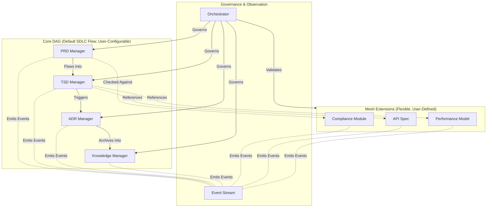

## 1. Context
The SDLC_IDE platform requires a safe, deterministic, multi-agent architecture that can:
* Manage the complete SDLC artifact graph across multiple projects
* Enforce a strict, auditable canonical SDLC lifecycle
* Support custom workflows, custom artifact types, and extensible schemas
* Provide a semantic Mesh layer for domain-specific documents and relationships
* Power analytics, ML, embeddings, and personalization via event streams
* Ensure all governance—structural, policy, and security—is centralized and deterministic

### Core Constraints
* Core DAG is always acyclic, deterministic, and fully auditable
* Default canonical pipeline: PRD → TSD → ADR → KB
* Custom pipelines are allowed through the Workflow Registry
* Extensions may never modify Core lineage or create cycles in the Core DAG
* Agent communication must obey:
    * Determinism
    * Predictability
    * Security
    * Zero implicit propagation

### Architectural Question
How can SDLC_IDE maintain strict, auditable SDLC governance while still supporting flexible custom pipelines and rich semantic extension documents?

### Conclusion
Adopt a Hybrid Directed Graph Architecture.

## 2. Decision
SDLC_IDE will implement a four-layer Hybrid Model:
* **Core Directed Acyclic Graph (DAG)**
  Authoritative SDLC workflow. Default pipeline + validated custom pipelines.
* **Mesh Extension Layer**
  Flexible semantic graph for domain-specific artifacts, custom types, and free-form relationships.
* **Event-Based Observer Layer**
  Immutable event stream powering analytics, monitoring, ML, embeddings, personalization.
* **Central Orchestrator**
  Enforces all structural rules, policy/security controls (via OPA), and validates all graph mutations.

## 3. High-Level Architecture Diagram

## 4. Core DAG (Authoritative, Acyclic, Deterministic)
The Core DAG encodes the canonical SDLC lifecycle.

### Invariants
* Always acyclic
* No lateral gossip, no implicit propagation
* All transitions are explicit and governed by the Orchestrator
* Full auditability of every mutation
* Deterministic evolution across all agents

### Default Pipeline
PRD → TSD → ADR → KB

### Custom Pipelines
Teams may define alternative pipelines—as long as they remain acyclic and policy-valid.
The Orchestrator verifies:
* Acyclicity via topological validation
* Type-safety of nodes
* ACL + OPA policy compliance
* Backward compatibility
* Deterministic transition semantics
The Core DAG is the authoritative SDLC lineage graph.

## 5. Mesh Extension Layer (Flexible, User-Defined Semantic Graph)
The Mesh layer supports domain-specific artifacts, free-form semantics, and custom relationships.

### Capabilities
* Custom document types
* Custom schemas
* Many-to-many semantic edges
* Cycles allowed inside Mesh only
* Domain modules (API Specs, Compliance, Performance Models, etc.)
* Analytical or support artifacts (design notes, test generators, validation modules)

### Constraints
* Mesh may annotate/reference Core, never the other way around
* Mesh cannot modify Core structure or influence DAG ordering
* Edges validated by Orchestrator using Mesh ACL rules (formalized in ADR-004)
This layer provides semantic richness without structural risk.

## 6. Event-Based Observer Layer
A distributed, append-only event infrastructure capturing:
* Document lifecycle changes
* Version updates
* Agent communications
* Workflow registrations/updates
* OPA policy evaluations
* Embedding refresh triggers
* User interaction signals (for personalization)

### Properties
* Immutable
* Observational only — cannot modify DAG or Mesh
* Powers analytics, search, ML, monitoring, governance intelligence
Events describe behavior, not structure.

## 7. Rationale
Neither pure DAG nor pure Mesh satisfies requirements.

| Requirement        | DAG     | Mesh  | Hybrid |
|--------------------|---------|-------|--------|
| Strict SDLC Flow   | ✔️      | ✖️    | ✔️     |
| Extensibility      | ✖️      | ✔️    | ✔️     |
| Predictability     | ✔️      | ✖️    | ✔️     |
| Semantic Linking   | Limited | ✔️    | ✔️     |
| Policy Enforcement | ✔️      | Risky | ✔️     |

The Hybrid design combines safety + flexibility, preserving strong lineage governance while enabling rich domain modeling.

## 8. Consequences
### Positive
* Deterministic and auditable SDLC flows
* Full workflow flexibility via validated custom pipelines
* Safe extensibility through Mesh
* Clean structural vs. behavioral separation
* High observability for analytics and ML
* Machine-verifiable correctness

### Negative
* Higher Orchestrator complexity
* Requires schema/ACL specification for Mesh
* UI must visually differentiate Core vs. Mesh

### Tradeoffs
All structural mutations pass through the Orchestrator—simplifying correctness but increasing implementation effort.

## 9. Alternatives Considered
* **❌ Full DAG Only**
  Too rigid; no semantic flexibility.
* **❌ Full Mesh Only**
  Unsafe for workflow governance; lacks deterministic lineage.
* **❌ Hub-and-Spoke**
  Central bottleneck; insufficient expressiveness for semantic modeling.

## 10. Decision Outcome
Accepted.

SDLC_IDE adopts the Hybrid Directed Graph Architecture:
* **Core DAG** — strict, authoritative SDLC lineage
* **Mesh Extensions** — semantic, flexible domain modeling
* **Event Observer Layer** — analytics, ML, embeddings
* **Orchestrator** — governance, validation, and policy enforcement

This ADR forms the foundation of SDLC_IDE’s architecture.

## Appendix A — Custom Workflow Registration & Enforcement
### A.1 Workflow Registry
Workflows declared at:
`.sdlc_ide/workflows/<workflow-id>.yaml`

Must contain:
* id
* version
* author
* status (draft | active | deprecated)
* scope
* nodes (artifact types)
* edges (directed transitions)
* optional migration metadata

### A.2 Validation Rules
Orchestrator enforces:
* Acyclicity
* Type safety
* OPA + ACL policies
* Backward compatibility
* No stranded or invalidated artifacts
* Deterministic transitions

### A.3 Activation Lifecycle
1. Contributor submits PR
2. CI validates syntax, semantics, OPA policy
3. On merge → Orchestrator performs final validation
4. Workflow marked active
5. Activation written to Event Stream

Ensures full traceability and governance.
