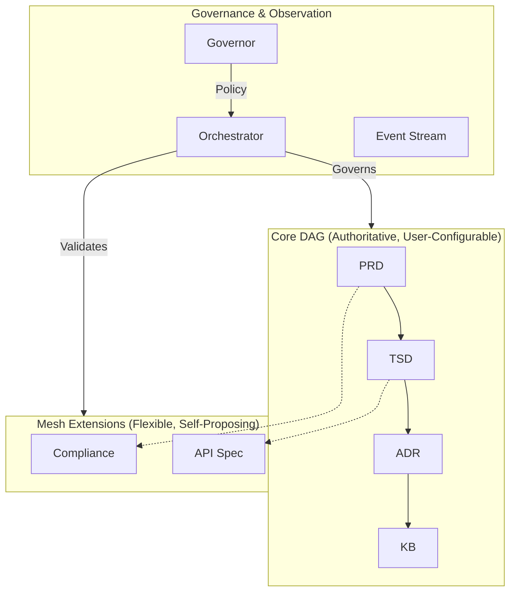
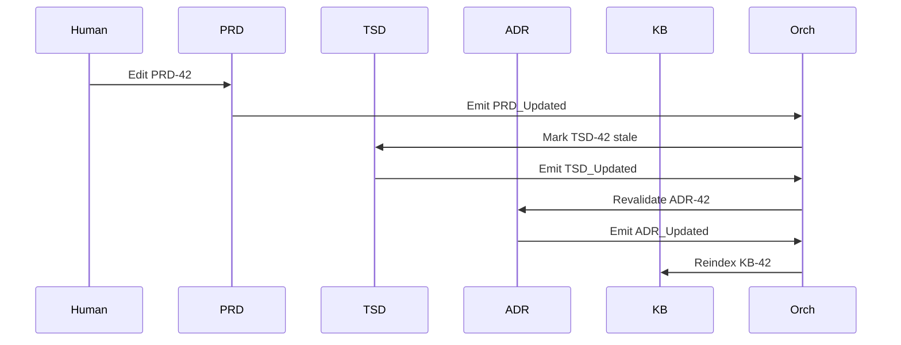

# 1. Context

The SDLC_IDE platform requires a multi-agent architecture to manage SDLC artifacts. The system must enforce a verifiable core SDLC lifecycle while supporting **user-defined custom workflows** and the **autonomous evolution of the Mesh layer** through self-proposing extensions.

**Key Requirements:**
- A strict, immutable Core DAG for canonical SDLC artifacts.
- A flexible Mesh layer that can safely evolve at runtime via an autonomous, agent-driven proposal system.
- Central governance via an Orchestrator and Governor (OPA/Rego) to enforce all structural, policy, and security rules.

---

# 2. Decision

We adopt a **Hybrid Directed Graph Architecture** with a **Self-Proposing Extensions** model for the Mesh layer, composed of four coordinated layers:
- **Core Directed Acyclic Graph (DAG):** Authoritative, user-configurable SDLC workflow.
- **Mesh Extension Layer:** Flexible semantic graph that evolves via the Self-Proposing Extensions pipeline.
- **Event-Based Observer Layer:** Immutable event stream for analytics and observability.
- **Central Orchestrator & Governor:** Enforces all rules, validates proposals, and mediates all graph mutations.

---

## A. Core Strict Directed Acyclic Graph (DAG)

Defines the authoritative SDLC lifecycle. Its sole invariant is **acyclicity**. While a default `PRD → TSD → ADR → KB` pipeline is provided, teams can register custom pipelines, which are validated by the Orchestrator.

#### Properties
*   No cycles — enforced by Orchestrator (ADR-005).
*   Deterministic propagation.
*   Agents communicate only downstream.
*   No gossip or opportunistic peer messaging.
*   Governed by a precise Orchestrator state machine.
*   The Orchestrator MUST reject all mutations to Core system behavior, topology, or governance rules not originating from a human-approved ADR.
*   Full auditability and reproducibility.

#### Core Agents and Flow Summary

| Agent           | Responsibilities                                                                      | Trigger       | Output        |
| --------------- | ------------------------------------------------------------------------------------- | ------------- | ------------- |
| **PRD Manager** | Accepts human-authored PRDs, stores version-controlled artifacts, emits `PRD_Updated` | Human edit    | `PRD_Updated` |
| **TSD Manager** | Generates/validates TSD from PRD, ensures consistency, emits `TSD_Updated`            | `PRD_Updated` | `TSD_Updated` |
| **ADR Manager** | Validates architectural decisions vs TSD, emits `ADR_Updated`                         | `TSD_Updated` | `ADR_Updated` |
| **KB Manager**  | Indexes artifacts, updates semantic/structural knowledge views, emits `KB_Updated`    | `ADR_Updated` | `KB_Updated`  |

---

## B. Selective Mesh Layer (Extensions)

Supports custom document types, semantic relations, and lateral workflows that can evolve through the **Self-Proposing Extensions Architecture**.

#### Characteristics
*   Completely user-defined document schemas.
*   All custom document types declare a schema, inbound/outbound edges, embedding strategy, and lifecycle state.
*   Mesh edges may connect to core or mesh, but **never mutate core nodes**.
*   Orchestrator validates structural rules; Governor enforces policies.

#### Gossip Rules
*   Allowed only within isolated mesh clusters.
*   Forbidden in core DAG and cannot influence core state.

#### Embedding Rules
*   Embeddings create **semantic**, not structural, links and must defer to the Orchestrator for lifecycle decisions.

#### Example Mesh Extension
```yaml
type: ArchitectureDiagram
schema: diagram.schema.json
inbound_edges: ["ADR"]
outbound_edges: []
embedding_strategy: structural+image
lifecycle: mesh
```

---

## B.1 Self-Proposing Extensions Architecture

Agents autonomously discover needs, generate **Mesh Extension Specs (MES)**, and propose them for registration.

#### Validation Pipeline
Proposals undergo a mandatory 2-stage validation:
1.  **Orchestrator:** Validates structural safety (e.g., cycle detection, DAG isolation).
2.  **Governor:** Enforces non-structural rules (e.g., security, compliance, ACLs).

#### Registration
Validated proposals are autonomously registered in the **Mesh Registry**, making new types available at runtime without human intervention. The Core DAG remains untouched.

#### Diagram of the Proposal Pipeline
```mermaid
graph TD
    A[Autonomous Agents<br/>(Discovery & Proposal Gen)] --> B(Mesh Extension Spec);
    B --> C{Validation};
    C --> D[ORCHESTRATOR<br/>Structural Rules];
    C --> E[GOVERNOR<br/>Policy + ACLs];
    D --> F{Result};
    E --> F;
    F -- Pass --> G[MESH REGISTRY<br/>(Dynamic Types)];
    G --> H(Runtime Mesh Layer);
    F -- Fail --> I([Proposal Rejected]);
```

#### Constraints
*   Extensions **must not mutate or override Core DAG rules**.
*   Extensions **must pass both structural and policy validation**.
*   All extension proposals, approvals, and rejections **must be emitted as immutable events**.

---

## C. Event-Based Observer Layer

An immutable, append-only event stream (per ADR-002) that provides full system observability without being authoritative for state. This maintains a strict separation between **structure** (graph) and **behavior** (events).

#### Captures
*   All lifecycle transitions and agent-to-agent interactions.
*   All user edits, merges, and rollback operations.
*   Embedding updates, validation failures, and policy violations.

---

# 3. High-Level Architecture Diagram



---

# 4. Rationale

The hybrid model is the only one that supports both **formal lifecycle guarantees** and **flexible, autonomous extensibility**. A pure DAG is too rigid, while a pure Mesh is too chaotic.

| Requirement         | DAG Only | Mesh Only | Hybrid |
| ------------------- | -------- | --------- | ------ |
| Strict SDLC flow    | ✅        | ❌         | ✅      |
| Extensibility       | ❌        | ✅         | ✅      |
| Predictability      | ✅        | ❌         | ✅      |
| Semantic links      | Limited  | ✅         | ✅      |
| Governance strength | Strong   | Weak      | Strong |
| Auditability        | High     | Low       | High   |

---

# 5. Consequences

### Positive
*   Strong governance via a dual Orchestrator + Governor model.
*   Deterministic, reproducible state transitions for the Core DAG.
*   Safe, autonomous integration of new document types.
*   Clear separation of concerns: structure (DAG), semantics (Mesh), and behavior (Events).
*   Fully auditable and traceable workspace (per ADR-004).

### Negative
*   Increased complexity in orchestration and governance logic.
*   All extensions require well-defined schema and edge declarations.
*   Higher operational overhead for managing OPA/Rego policies.

---

# 6. Alternatives Considered

### A. Full DAG
Rejected — too rigid, lacks semantic flexibility and autonomous adaptation.

### B. Full Mesh
Rejected — nondeterministic, unsafe, and ungovernable for core SDLC processes.

### C. Hub-and-Spoke
Rejected — creates a central bottleneck and loses the expressive power of the mesh.

---

# 7. Decision Outcome

**Accepted.** This ADR establishes the foundational architecture for the SDLC_IDE platform, balancing strong governance with autonomous extensibility.

---

# 8. Dependencies & Cross-References

**Depends On:** None (foundational)

**Depended By:**
*   ADR-002: Event Streaming
*   ADR-003: Vectorization
*   ADR-004: Persistence
*   ADR-005: Orchestrator
*   ADR-006: Custom Document Types
*   ADR-007: Failure Modes

---

# 9. Implementation Notes

The implementation will require careful design of the Orchestrator (ADR-005) to handle the two-stage validation pipeline in coordination with the Governor. The Persistence layer (ADR-004) must also be designed to correctly partition the Core DAG from the dynamic Mesh registry.

---

# 10. Glossary

| Term             | Definition                                             |
| ---------------- | ------------------------------------------------------ |
| **Core DAG**     | Authoritative, acyclic graph for the SDLC lifecycle.   |
| **Mesh**         | Flexible extension layer for user-defined, self-proposing documents. |
| **Orchestrator** | Enforces structural rules and lifecycle transitions.   |
| **Governor**     | OPA/Rego engine enforcing ACLs, compliance, and policy. |
| **MES**          | Mesh Extension Spec: A proposal for a new Mesh type.   |
| **Event**        | Immutable observation of system activity.              |

---

# 11. Appendix — Example State Transition

### Human updates PRD-42

1.  `PRD_Updated` emitted
2.  Orchestrator marks TSD-42 pending_sync
3.  TSD regenerates & publishes `TSD_Updated`
4.  Orchestrator revalidates ADR
5.  ADR publishes `ADR_Updated`
6.  KB reindexes
7.  Final state: **PRD-42 → TSD-42 → ADR-42 → KB-42**

### Optional Sequence Diagram


