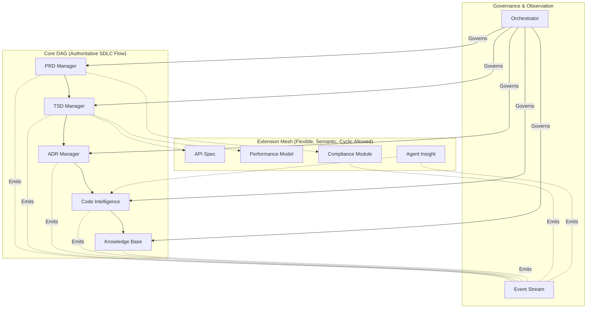

# 1. Context

SDLC_IDE is a multi‑agent software development environment designed to manage all SDLC artifacts—from product requirements to specifications, design decisions, code, and knowledge base materials. The system must support:
- Strict communication boundaries between core document-managing agents
- Deterministic and auditable lifecycle transitions
- User‑defined custom workflows for organizations with non‑standard development processes
- Machine‑readable technical artifacts (TSD, ADRs, code intelligence)
- Human‑readable product workflows (PRDs)
- Extensible, user‑defined document types and agents
- AI‑assisted analytics using embeddings, semantic reasoning, and event streams
- Secure interactions governed by a central Orchestrator

### Key Constraints
- Core lifecycle must remain acyclic. The default is `PRD → TSD → ADR → Code → KB`, but this flow is customizable.
- Extensions must never introduce cycles into the authoritative SDLC lineage.
- No implicit agent‑to‑agent propagation—all communication is mediated by the Orchestrator.
- Semantic mesh relations must not override or mutate core SDLC structure.

### Core Questions
- How do we allow flexible custom document types without risking SDLC integrity?
- How do we ensure auditability and strict lineage in a multi‑agent system?
- How can semantic insights be incorporated without becoming structural dependencies?

# 2. Decision

SDLC_IDE will use a **Hybrid Directed Graph Architecture** composed of:
- A **Core Directed Acyclic Graph (DAG)** — authoritative SDLC lineage
- A **Selective Mesh Extension Layer** — flexible, semantic, user‑defined metadata
- An **Event Observer Layer** — analytics, ML, and cross‑agent signal distribution

### Diagram

### Architectural Principles

#### A. Core DAG (Strict, Authoritative)
Represents the SDLC's canonical artifact lineage.
- Acyclicity is the primary invariant.
- Artifacts have one authoritative version chain and strict declared upstream dependencies.
- Required for governance, audits, reproducibility, and analysis.

#### B. Mesh Extension Layer (Flexible, Semantic)
Supports unlimited user‑defined artifacts: insights, compliance tags, risks, test generators, models, etc.
- Cycles permitted and common.
- Mesh edges annotate, but never influence DAG lineage.
- Cross‑linking is allowed in any semantic direction, subject to type rules (defined in ADR‑006).

#### C. Governance & Observability
- **The Orchestrator enforces:** acyclicity, lifecycle transitions, access control, and allowed edge types.
- **The Event Layer records all activity:** document changes, embeddings, agent observations, and lineage mutations.

# 3. Rationale

A hybrid approach is necessary:
- A pure DAG is overly restrictive for modern AI‑assisted systems.
- A pure mesh is too flexible for SDLC governance and would destroy artifact lineage reliability.

The hybrid model provides the benefits of both.

| Requirement | Pure DAG | Pure Mesh | Hybrid |
| :--- | :---: | :---: | :---: |
| SDLC lineage | ✔️ | ✖️ | ✔️ |
| Extensibility | ✖️ | ✔️ | ✔️ |
| Auditability | ✔️ | ✖️ | ✔️ |
| Semantic richness | Limited | ✔️ | ✔️ |
| Safety & predictability | ✔️ | Risky | ✔️ |
| Multi-agent support | Weak | Weak | Strong |

# 4. Consequences

### Positive Outcomes
- Governable SDLC pipeline with strict structural guarantees
- Safe extension ecosystem for custom doc types, agents, and metadata
- Predictable multi‑agent workflows with enforced boundaries
- Rich semantic graph for embeddings, search, LLM reasoning, and analytics
- Facilitates audits, documentation consistency, and impact analysis

### Negative / Neutral Tradeoffs
- More complex than single‑model architectures
- Orchestrator becomes a sophisticated component (addressed in ADR‑005)
- UI must clearly differentiate DAG edges from Mesh edges
- Mesh types require well-defined schemas and ACLs (ADR‑006)

# 5. Alternatives Considered

### ❌ Full DAG
- **Rejected because:** Too rigid; cannot support semantic annotations, agent insights, custom extensions.

### ❌ Full Mesh
- **Rejected because:** Unpredictable; cannot enforce SDLC lineage; high risk of cycles and inconsistent agent behavior.

### ❌ Hub‑and‑Spoke
- **Rejected because:** Central bottleneck; no support for rich multi‑directional semantic linking.

# 6. Dependencies

### Depends on:
- None — foundational architecture.

### Depended by:
- ADR‑002 — Event System
- ADR‑003 — Orchestrator & Enforcement
- ADR‑004 — Persistence / Storage Model
- ADR‑005 — Embedding System
- ADR‑006 — Custom Document Types & ACLs
- ADR‑009 — Agent Framework
- ADR‑010 — Vector Database
