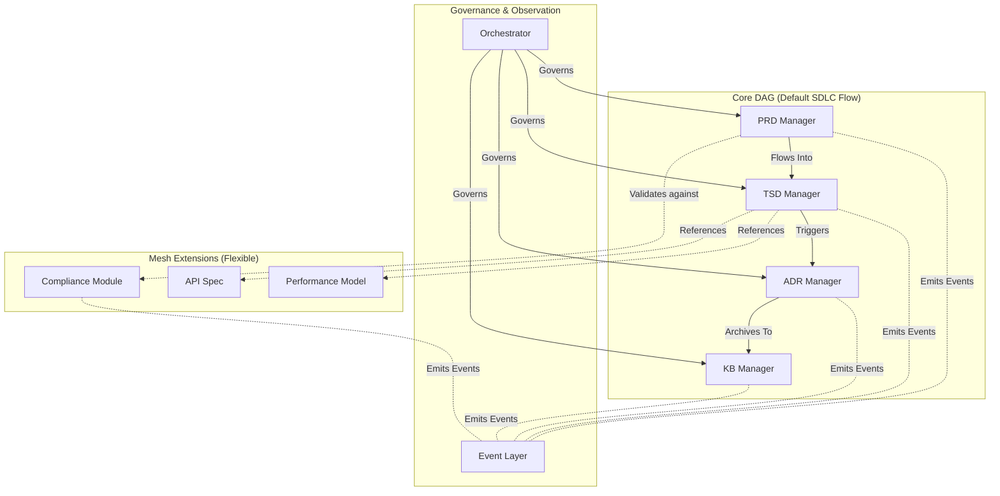

# ADR-001: Hybrid Directed Graph Architecture

## 1. Context
SDLC_IDE requires a multi‑agent system capable of managing all document artifacts throughout the software development lifecycle. The system must support:
- **Strict communication boundaries** between core document managers
- **Deterministic and auditable** lifecycle transitions and user-defined custom workflows.
- **Machine‑readable processing** for technical specifications
- **Human‑readable workflows** for product requirement documents
- **Integration of user‑defined document types** without destabilizing core flows
- **AI‑assisted analytics** using embeddings, event observations, and semantic reasoning
- **Secure, orchestrator‑governed interactions** between agents

### Key Constraints
- **Core document agents follow a strict, acyclic lifecycle.** The default is `PRD → TSD → ADR → Code`, but this is configurable.
- **Extensions** (custom doc types, schemas, agents, and relations) must be allowed without compromising core flow.
- **Communication rules** must enforce determinism, security, and predictability.
- **Extensions must never introduce cycles** or upstream influence on the Core DAG.

### Key Questions
- How can custom document types integrate safely?
- How can structure remain strict while allowing extensibility?
- How can agent communication avoid unauthorized propagation?

## 2. Decision
We will adopt a **Hybrid Directed Graph Architecture** consisting of a strict **Core Directed Acyclic Graph (DAG)** for authoritative SDLC artifacts and a flexible **Selective Mesh Extension Layer** for annotations and domain-specific documents.

*The diagram above illustrates the default SDLC workflow. The Core DAG is configurable to support user-defined workflows.*

### A. Core Directed Acyclic Graph (DAG)
This sub-graph represents the strict manufacturing pipeline of software engineering artifacts. The system supports **user-defined custom workflows** governed by one primary invariant: **acyclicity**.

### B. Selective Mesh Extension Layer (Flexible, User‑Defined)
This sub-graph supports arbitrary, user‑defined document types and multi‑directional semantic relations. Cycles are permitted within the mesh.

### C. Enforcement
Graph rules are declared here, but enforcement is delegated:
- **ADR-005 (Orchestrator):** Enforces the invariants defined in this ADR.
- **ADR-004 (Persistence Layer):** Defines how graph nodes and edges are stored.

## 3. Rationale

A pure DAG is too rigid for modern, agent-driven ecosystems, while a full mesh is too chaotic for auditable SDLC governance. A hybrid model provides the optimal balance.

| Requirement | DAG | Mesh | Hybrid |
| :--- | :---: | :---: | :---: |
| Strict SDLC flow | ✔️ | ✖️ | ✔️ |
| Extensibility | ✖️ | ✔️ | ✔️ |
| Predictability | ✔️ | ✖️ | ✔️ |
| Semantic linking | Limited | ✔️ | ✔️ |
| Safety | ✔️ | Risky | ✔️ |

## 4. Consequences

### Positive
- **Strong Governance:** Clear separation of authoritative lineage (DAG) vs. flexible annotation (Mesh).
- **Safe Extensibility:** Supports both a default workflow and user-defined custom SDLC pipelines without corrupting core processes.
- **Clarity:** Enables safe change propagation via the DAG and rich, domain-specific intelligence via the Mesh.

### Negative / Neutral
- **Increased Complexity:** The Orchestrator's complexity increases to manage custom workflows (addressed in ADR-005).
- **Tooling:** UI and tooling must visually distinguish between DAG links (lineage) and Mesh links (annotations) to avoid confusion.

## 5. Alternatives Considered

### ❌ A. Full DAG Only
- **Rejected because:** Too rigid. Cannot support knowledge graph semantics, custom doc types, or the natural feedback loops common in metadata graphs.

### ❌ B. Full Mesh Only
- **Rejected because:** Unenforceable lifecycle rules. The strict, predictable lineage of the SDLC would be lost, making impact analysis unreliable.

### ❌ C. Hub‑and‑Spoke Architecture
- **Rejected because:** The central hub becomes a critical bottleneck, and this model is not flexible enough for rich semantic links.

## 6. Dependencies

- **Depends On:** None — this is a foundational ADR.
- **Depended By:** ADR-002 (Events), ADR-003 (Embeddings), ADR-004 (Persistence), ADR-005 (Orchestrator), ADR-006 (Custom Docs), ADR-009 (Agents), ADR-010 (Vector DB).
