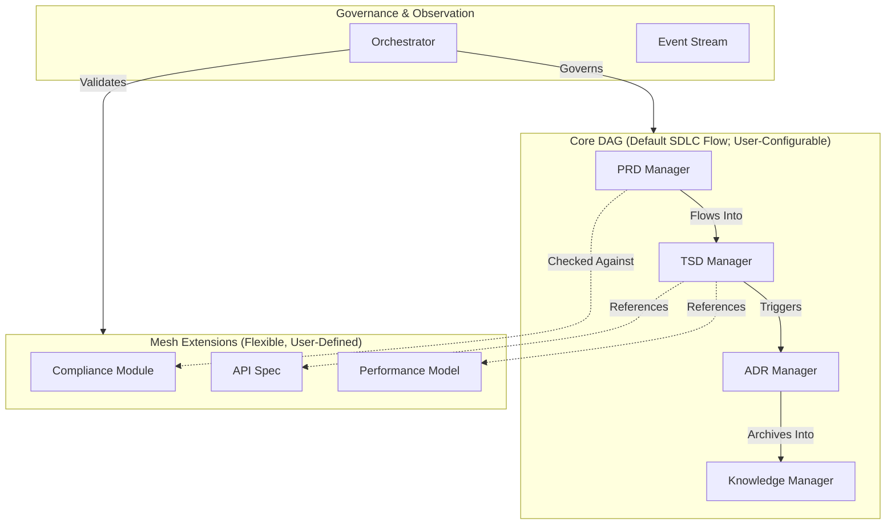

# 1. Context
The SDLC_IDE platform requires a multi‑agent architecture to manage SDLC artifacts. The system must enforce a verifiable core SDLC lifecycle while supporting user‑defined custom workflows, extension documents, and semantic relationships.

**Key Requirements:**
- Strict communication boundaries between core document managers.
- Deterministic, auditable lifecycle transitions for both default and custom workflows.
- Extensible domain modeling through custom artifact types and schemas.
- Central governance via an Orchestrator that enforces all structural, workflow, and policy rules.

### Core Constraints
- The **Core DAG** must remain strictly acyclic.
- A canonical **default SDLC pipeline** (`PRD → TSD → ADR → KB`) is provided, but this is **overridable** via a declarative Workflow Registry.
- Extensions must never introduce upstream influence or cycles into the Core DAG.

# 2. Decision
We adopt a **Hybrid Directed Graph Architecture**, composed of four coordinated layers:
- **Core Directed Acyclic Graph (DAG):** Authoritative SDLC workflow with support for validated, user-defined custom pipelines.
- **Mesh Extension Layer:** Flexible semantic graph for custom types and domain-specific artifacts.
- **Event‑Based Observer Layer:** Immutable event stream for analytics, monitoring, and ML.
- **Central Orchestrator:** Enforces all rules, validates workflows, and mediates all graph mutations.

# 3. High-Level Architecture Diagram

*The diagram above illustrates the default SDLC lifecycle. The Core DAG is fully configurable via registered custom workflows.*

# 4. Core DAG (Authoritative, Acyclic, User‑Configurable)
The Core DAG defines the authoritative SDLC lifecycle. Its sole invariant is **acyclicity**. While a default pipeline is provided, teams can author and register **custom pipelines** (see Appendix A).

# 5. Mesh Extension Layer (Flexible, User‑Defined)
The Mesh Layer supports arbitrary user‑defined documents, schemas, and semantic relationships. Cycles are permitted within the Mesh but must never involve the Core DAG.

# 6. Event‑Based Observer Layer
A distributed event system provides system-wide observability. It is purely observational and maintains a strict separation between **structure** (graph) and **behavior** (events).

# 7. Rationale
A pure DAG is too rigid; a pure Mesh is too chaotic. The hybrid model provides the optimal balance.

| Requirement | DAG | Mesh | Hybrid |
| :--- | :---: | :---: | :---: |
| Strict, Auditable Lifecycle | ✔️ | ✖️ | ✔️ |
| Extensibility | ✖️ | ✔️ | ✔️ |
| Predictability | ✔️ | ✖️ | ✔️ |
| Semantic Linking | Limited | ✔️ | ✔️ |

# 8. Consequences
- **Positive:** Strong governance with deterministic SDLC flows; safe extensibility via custom workflows and the Mesh.
- **Negative:** Increased Orchestrator complexity; requires schema/ACL design for Mesh documents.

# 9. Alternatives Considered
- **Full DAG Only:** Too restrictive; no semantic flexibility.
- **Full Mesh Only:** Unenforceable lifecycle; chaotic and unsafe for compliance.
- **Hub‑and‑Spoke:** Central bottleneck; limited expressiveness.

# 10. Decision Outcome
**Accepted.** This ADR establishes the foundational architecture for the SDLC_IDE platform.

---

## Appendix A — Custom Workflow Registration & Enforcement

### Summary
The system ships with a default canonical pipeline (`PRD → TSD → ADR → KB`), but teams may define custom pipelines through the declarative **Workflow Registry**. The Orchestrator validates all workflows before activation.

### Declarative Workflow Files
- **Location:** `.sdlc_ide/workflows/<workflow-id>.yaml`
- **Required Fields:** `id`, `version`, `author`, `status` (`draft` | `active` | `deprecated`), `scope`, `nodes`, and `edges`.

### Governance & Enforcement
Workflow PRs are subject to:
1. **Acyclicity Checks** (Topological validation)
2. **Type Safety Verification** (Nodes map to known artifact types)
3. **ACL & OPA Policy Validation**
4. **Backward‑Compatibility Checks** (Ensures no existing artifacts are stranded)

Upon merge, the Orchestrator performs a final validation, activates the workflow, and logs the event for a full audit trail.
