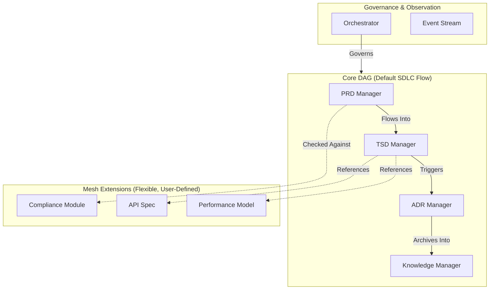

# 1. Context
The SDLC_IDE platform requires a multi‑agent architecture for managing SDLC artifacts. The system must support a verifiable core SDLC flow while also allowing for **user-defined custom workflows** via a declarative registry.

**Key requirements include:**
- Strict communication boundaries between core document managers.
- Deterministic, auditable lifecycle transitions for both default and custom workflows.
- Extensible domain modeling through custom document types and schemas.
- Central governance via an Orchestrator enforcing all structural and policy rules.

### Core Constraints
- The Core DAG follows a strict, **acyclic** lifecycle. The default workflow is `PRD → TSD → ADR → KB`, but this path is **configurable**.
- Extensions must not destabilize the Core DAG or introduce upstream influence.
- Agent communication must obey determinism, predictability, and security, with zero implicit propagation.

### Architectural Question
How do we support strict SDLC governance while allowing flexible, domain‑specific semantic relationships and custom doc types?

**Conclusion:** We adopt a Hybrid Directed Graph Architecture.

# 2. Decision
SDLC_IDE will use a **Hybrid Directed Graph Architecture** composed of:
- **Core Directed Acyclic Graph (DAG):** The authoritative, user-configurable SDLC lifecycle.
- **Mesh Extension Layer:** Flexible, user‑defined, many‑to‑many semantic relations.
- **Event‑Based Observer Layer:** Analytics, monitoring, and ML signals.
- **Central Orchestrator:** Governs all structural mutations and policy enforcement.

### High‑Level Diagram

*The diagram above illustrates the default SDLC workflow. The Core DAG is configurable to support user-defined workflows.*

# 3. Core DAG (Authoritative, Acyclic)
The Core DAG represents the canonical SDLC workflow. Its primary invariant is **acyclicity**. While a default `PRD → TSD → ADR → KB` pipeline is provided, teams can **register custom pipelines** that the system validates and enforces.

*(For a detailed design of the custom workflow mechanism, see Appendix A.)*

# 4. Mesh Extension Layer (Flexible, User‑Defined)
The Mesh enables arbitrary user‑defined documents, schemas, and semantic relations. Cycles are permitted within the Mesh but must never involve the Core DAG.

# 5. Event‑Based Observer Layer
A distributed event system captures all system activities, enforcing a strict separation between **structure** (the graph) and **behavior** (events).

# 6. Rationale
A pure DAG is too rigid, while a pure mesh is too chaotic. The hybrid model provides the optimal balance of structure and flexibility.

| Requirement | DAG | Mesh | Hybrid |
| :--- | :---: | :---: | :---: |
| Strict, Auditable Flow | ✔️ | ✖️ | ✔️ |
| Extensibility | ✖️ | ✔️ | ✔️ |
| Predictability | ✔️ | ✖️ | ✔️ |
| Semantic Linking | Limited | ✔️ | ✔️ |

# 7. Consequences
- **Positive:** Strong governance with a deterministic, yet highly configurable, SDLC lifecycle.
- **Negative:** Increased complexity in the Orchestrator to manage the workflow registry and validation.

# 8. Alternatives Considered
- **Full DAG Only:** Rejected (too restrictive).
- **Full Mesh Only:** Rejected (unenforceable lifecycle rules).
- **Hub‑and‑Spoke:** Rejected (central bottleneck).

# 9. Decision Outcome
**Accepted.** The SDLC_IDE will implement a Core DAG for authoritative, configurable workflows, a Mesh Extension Layer for flexible semantics, an Event Layer for observation, and an Orchestrator for governance.

---

## Appendix A: Custom Workflow Registration and Enforcement

### Summary
The system provides a default canonical pipeline (`PRD → TSD → ADR → KB`) but allows teams to register user‑defined pipelines via a declarative workflow registry. Custom workflows are validated (acyclic, type‑safe), stored in the workspace, and governed by the Orchestrator/OPA before activation.

### Policy and Enforcement
- **Default Pipeline:** Core agents assume the default workflow unless a validated custom workflow is active for a given project.
- **Declarative Registration:** Custom workflows are defined in YAML/JSON and stored in the repository (e.g., `.sdlc_ide/workflows/<name>.yaml`).
- **Governed Changes:** All changes to workflows must be proposed via a pull request and pass automated checks (e.g., acyclicity, type safety) and OPA policy to be merged and activated.
- **Validation:** The Orchestrator validates acyclicity, type safety, and ACLs for all custom workflows.

### Storage and Lifecycle
- **File Location:** `.sdlc_ide/workflows/<workflow-id>.yaml`.
- **Activation:** On merge of an approved PR, the Orchestrator validates the workflow and sets its status to `active`.
- **Audit Trail:** All workflow management events are recorded on the event stream.
