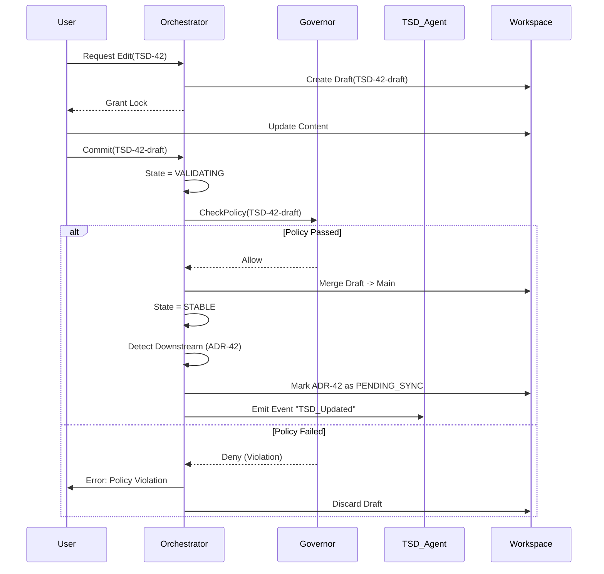

## 1. Context

Following the adoption of the Hybrid Directed Graph Architecture (ADR-001), the SDLC_IDE requires a central authority to manage state transitions. Without a centralized coordinator, the system risks:

*   **Race Conditions:** Multiple agents attempting to update the TSD simultaneously.
*   **Infinite Loops:** Agents triggering each other in a cycle (e.g., TSD updates ADR, which updates TSD).
*   **Partial Failures:** A crash during a multi-agent workflow leaving the workspace in an inconsistent state.
*   **Policy Evasion:** Agents bypassing governance rules (Governor/OPA) to force an update.

The Orchestrator must act as the "kernel" of the IDE, enforcing the strict DAG topology of the Core while managing the flexible event subscriptions of the Mesh.

### Key Constraints

*   **Single Writer Principle:** Only the Orchestrator can commit changes to the Graph Topology (ADR-004).
*   **Non-Blocking Reads:** Agents must be able to read state without locking the Orchestrator.
*   **Cycle Detection:** Must prevent Mesh extensions from introducing cycles into the graph.
*   **Staleness Propagation:** Downstream nodes must be explicitly notified when upstream dependencies change.

---

## 2. Decision

We will implement a **State-Machine-Driven Centralized Orchestrator** using a **Saga Pattern** for multi-step agent workflows.

### A. Core Responsibilities

1.  **Topology Guard:** Validates every edge creation request. Rejects any edge $(u, v)$ if a path $v \to \dots \to u$ already exists.
2.  **Lifecycle Manager:** Owns the finite state machine (FSM) for every Document Node (PRD, TSD, etc.).
3.  **Signal Dispatcher:** Calculates the "Blast Radius" of a change and marks downstream nodes as `STALE`.
4.  **Gatekeeper:** Invokes the Governor (OPA) before transitioning any node to `COMMITTED`.

### B. The Node Lifecycle State Machine

Every node in the graph (Core or Mesh) exists in one of the following states:

| State | Description | Allowed Actions |
| :--- | :--- | :--- |
| **STABLE** | Resting state. Latest version is authoritative. | Edit (Human), Trigger (Agent) |
| **DRAFT** | Being edited/generated. Invisible to downstream agents. | Save, Commit, Discard |
| **VALIDATING** | Undergoing Schema & Policy checks (Governor). | Approve, Reject |
| **PENDING_SYNC** | Marked stale due to upstream change. | Regenerate, Ignore |
| **LOCKED** | Currently being processed by an Agent. | Cancel |

---

## 3. Detailed Logic Design

### A. Cycle Detection Algorithm

To support high-frequency Mesh updates, we cannot re-traverse the entire graph on every edit. We will use an **Incremental Cycle Detection** strategy (variant of Pearce’s algorithm or simple DFS on the affected subgraph).

**Logic:**
Let $G = (V, E)$ be the graph.
When adding edge $A \to B$:

1.  Check if $A == B$ (Self-loop). **Reject.**
2.  Check if path $B \to \dots \to A$ exists.
    *   Use BFS/DFS starting from $B$.
    *   If $A$ is visited, a cycle is detected. **Reject.**
3.  If strict DAG (Core): Ensure $A$ and $B$ are valid Core types.
4.  If Mesh: Ensure $A \to B$ is declared in $A$'s schema allowed_outbound.

*Performance Constraint:* For graph size $|V| < 10,000$ (typical project), standard DFS is negligible ($< 10ms$).

### B. The "Staleness Wavefront" (Change Propagation)

When a Core node updates (e.g., `PRD-v2` committed), the Orchestrator does **not** auto-trigger all downstream agents immediately (to prevent cascading hallucinations). Instead, it propagates a `STALE` signal.

**Algorithm:**

1.  **Commit:** `PRD-1` transitions to `v2`.
2.  **Identify Children:** Orchestrator queries $G$ for all $v$ where $(PRD, v) \in E$.
3.  **Mark Stale:** Set $v$.status = `PENDING_SYNC`.
4.  **Notify:** Emit event `Node_Stale(id=v.id, reason="Upstream PRD-1 updated")`.
5.  **Agent Reaction:** The Agent responsible for $v$ (e.g., TSD Manager) sees the event and decides when to trigger regeneration.

### C. Sequence Diagram: Orchestrated Update



---

## 4. Error Handling & Recovery

### Transactionality

The Orchestrator treats multi-step operations as **Sagas**.

*   **Scenario:** TSD generation fails halfway.
*   **Recovery:** Orchestrator receives `Agent_Failure` or times out.
*   **Action:** Rollback node state from `LOCKED` to `STABLE` (reverting to previous valid version).

### Deadlock Prevention

*   **Timeout:** All `LOCKED` states have a TTL (e.g., 30 seconds for non-interactive agents).
*   **Force Unlock:** Admin/User can force-release a lock via UI (requires `admin` permission).

---

## 5. Consequences

### Positive

*   **Guaranteed Consistency:** It is impossible for the system to enter a cyclic state.
*   **Observability:** Every state transition is centralized, making debugging easy.
*   **Lazy Computation:** The `PENDING_SYNC` pattern prevents "thundering herd" AI generation by allowing agents to batch or delay updates.

### Negative

*   **Single Point of Failure:** If the Orchestrator crashes, no writes can occur (Read-only mode).
*   **Latency:** Every write requires a round-trip to the Orchestrator + Governor.

---

## 6. Implementation Notes

### Data Structures

The Graph is stored in memory for $O(1)$ access, backed by the Workspace (ADR-004) for persistence.

```typescript
interface GraphNode {
  id: string;
  type: NodeType;
  version: number;
  hash: string;
  state: LifecycleState; // STABLE, LOCKED, etc.
  dependencies: Set<string>; // Upstream IDs
  dependents: Set<string>;   // Downstream IDs
}
```

### Staleness Policy Configuration

Agents can configure how they react to `PENDING_SYNC`:

*   **Eager:** Immediately trigger regeneration (Good for TSD).
*   **Lazy:** Wait for user confirmation (Good for ADRs/Architectural reviews).
*   **Batched:** Wait for $X$ minutes or $N$ upstream events.

---

## 7. Open Questions

1.  **Merge Conflicts:** How does the Orchestrator handle two users editing the same "Mesh" document concurrently? (Tentative: Optimistic locking via `version` number).
2.  **Governor Latency:** If OPA policies become complex, will blocking validation degrade UI performance?

---

## 8. Appendix: Validation Logic

**Pseudo-code for `commit_node(node_id, new_content)`**

```python
def commit_node(node_id, new_content):
    # 1. Lock check
    if node.state == LOCKED and node.owner != current_user:
        raise LockedError()

    # 2. Structural Validation (if edges changed)
    if edges_changed(node, new_content):
        if detect_cycles(new_content.edges):
            raise CycleError()

    # 3. Policy Validation
    violations = governor.evaluate(node, new_content)
    if violations:
        emit_event("Validation_Failed", violations)
        return

    # 4. Persistence
    version_id = workspace.write(node_id, new_content)

    # 5. Propagation
    downstream_nodes = graph.get_dependents(node_id)
    for child in downstream_nodes:
        set_state(child, "PENDING_SYNC")
        emit_event("Node_Stale", child)

    # 6. Finalize
    set_state(node_id, "STABLE")
    emit_event("Node_Committed", version_id)
```
