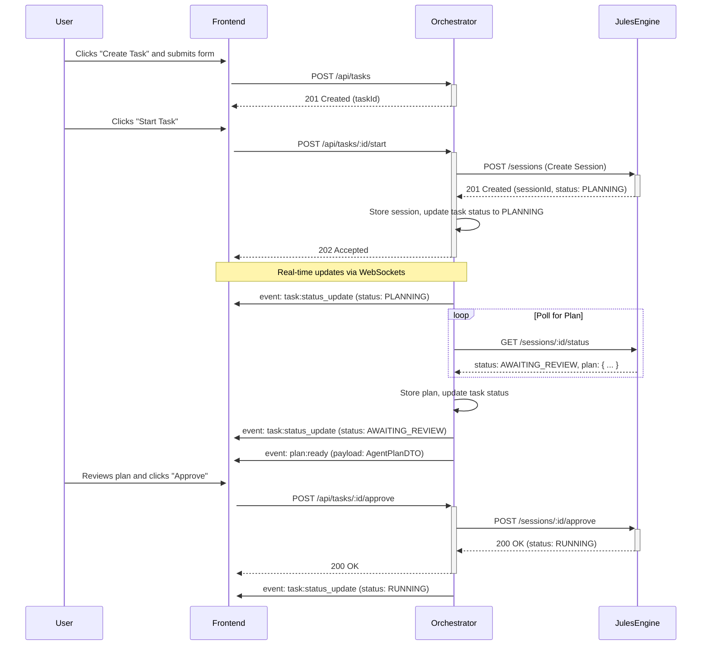

# API Contract: Orchestrator ↔ Jules Engine

This document defines the API contract between the Backend Orchestrator (Control Plane) and the Jules Engine (Execution Plane).

## 1. Overview

The interaction model is asynchronous. The Orchestrator initiates tasks by creating a "Session" with the Jules Engine. It then uses a combination of polling and webhooks (if available) to receive real-time updates on the Session's progress, activities, and generated artifacts.

- **Orchestrator**: Manages the task lifecycle, user interactions, and the overall workflow DAG.
- **Jules Engine**: Executes the core logic of a task within a secure sandbox, generating plans, code, and other artifacts.

---

## 2. Internal Orchestrator API Endpoints

These are the REST endpoints exposed by the Orchestrator to the Frontend.

### `POST /api/tasks`

Creates a new task in the system.

- **Request Body**:
  ```json
  {
    "name": "Refactor user authentication module",
    "repoUrl": "https://github.com/company/project.git",
    "branch": "feature/JULES-123-refactor",
    "prompt": "Analyze the auth.ts file. Convert all promise-based handlers to async/await and add JSDoc comments.",
    "agentIds": ["refactor-agent", "doc-writer-agent"],
    "settings": {
      "mode": "manual_approval",
      "dag": {
        "nodes": [
          {"id": "refactor-agent"},
          {"id": "doc-writer-agent"}
        ],
        "edges": [
          {"from": "refactor-agent", "to": "doc-writer-agent"}
        ]
      }
    }
  }
  ```
- **Response `201 Created`**:
  ```json
  {
    "taskId": "task-abcdef-123456",
    "status": "PENDING",
    "createdAt": "2023-10-27T10:00:00Z"
  }
  ```

### `POST /api/tasks/:id/start`

Starts the execution of a pending task. This triggers the Orchestrator to create a Session with the Jules Engine.

- **Response `202 Accepted`**:
  ```json
  {
    "taskId": "task-abcdef-123456",
    "status": "QUEUED"
  }
  ```

### `GET /api/tasks/:id`

Retrieves the complete state of a task, including its status, associated sessions, activities, and artifacts.

- **Response `200 OK`**:
  ```json
  {
    "taskId": "task-abcdef-123456",
    "status": "AWAITING_REVIEW",
    "plan": { /* AgentPlanDTO */ },
    "activities": [ /* ActivityDTO[] */ ],
    "artifacts": [ /* ArtifactDTO[] */ ],
    "prUrl": "https://github.com/company/project/pull/42"
  }
  ```

### `POST /api/tasks/:id/approve`

Approves a plan or a generated artifact, allowing the workflow to proceed.

- **Request Body**:
  ```json
  {
    "planId": "plan-xyz-789",
    "comments": "Looks good, proceed with implementation."
  }
  ```
- **Response `200 OK`**:
  ```json
  {
    "taskId": "task-abcdef-123456",
    "status": "RUNNING"
  }
  ```

---

## 3. Jules API Integration Contract (Orchestrator → Jules)

This section defines how the Orchestrator's internal `JulesClient` wrapper interacts with the Jules Engine's API.

### A. Session Creation

To start a task, the Orchestrator creates a Session in Jules.

- **Endpoint**: `POST /sessions`
- **Payload Sent by Orchestrator**:
  ```json
  {
    "source": {
      "repoUrl": "https://github.com/company/project.git",
      "branch": "feature/JULES-123-refactor"
    },
    "prompt": "Analyze the auth.ts file. Convert all promise-based handlers to async/await and add JSDoc comments.",
    "agentConfig": {
      "type": "refactor-agent" // The specific agent to run for this session
    },
    "webhookUrl": "https://orchestrator.internal/api/webhooks/jules" // Optional
  }
  ```
- **Note on Multi-Agent Workflows**: For tasks involving a DAG of multiple agents, the Orchestrator is responsible for managing the workflow. It will create one Jules Session for each node in the DAG, triggering them sequentially or in parallel as dependencies are met. The `agentConfig` will specify the single agent responsible for that specific session.
- **Response Received from Jules**:
  ```json
  {
    "sessionId": "session-ghijkl-789012",
    "status": "PLANNING",
    "plan": { /* Raw plan object from Jules */ }
  }
  ```

### B. Polling Strategy

The Orchestrator polls Jules to get updates if WebSockets or webhooks are not used.

- **Endpoint**: `GET /sessions/:id/status`
- **Polling Frequency**: Starts at 5 seconds, backs off exponentially if status is unchanged.
- **Response Received from Jules**:
  ```json
  {
    "sessionId": "session-ghijkl-789012",
    "status": "RUNNING", // PLANNING, RUNNING, AWAITING_REVIEW, COMPLETED, FAILED
    "activities": [
      {
        "activityId": "act-mno-345",
        "type": "file_edit",
        "status": "COMPLETED",
        "timestamp": "2023-10-27T10:05:00Z",
        "details": { "file": "src/auth.ts" }
      }
    ]
  }
  ```

### C. Artifact Retrieval

When an activity generates an artifact (e.g., a diff), the Orchestrator fetches it.

- **Endpoint**: `GET /sessions/:id/artifacts/:artifactId`
- **Response Received from Jules**:
  ```json
  {
    "artifactId": "artifact-pqr-678",
    "type": "diff",
    "format": "unified",
    "content": "--- a/src/auth.ts\n+++ b/src/auth.ts\n@@ -10,5 +10,5 @@\n-  return new Promise(resolve => resolve(true));\n+  return await Promise.resolve(true);\n",
    "metadata": { "file": "src/auth.ts" }
  }
  ```

### D. Plan/Artifact Approval

When a user approves a plan, the Orchestrator signals Jules to proceed with the execution.

- **Endpoint**: `POST /sessions/:id/approve`
- **Payload Sent by Orchestrator**:
  ```json
  {
    "planId": "plan-xyz-789"
  }
  ```
- **Response Received from Jules**:
  ```json
  {
    "sessionId": "session-ghijkl-789012",
    "status": "RUNNING"
  }
  ```

---

## 4. WebSocket Event Model (Orchestrator → Frontend)

The Orchestrator pushes real-time updates to the Frontend via WebSockets.

- **`task:status_update`**: Sent when the overall task status changes.
  ```json
  {
    "event": "task:status_update",
    "payload": {
      "taskId": "task-abcdef-123456",
      "newStatus": "RUNNING",
      "message": "Plan approved, execution started."
    }
  }
  ```
- **`activity:new`**: Sent when a new activity is created by Jules.
  ```json
  {
    "event": "activity:new",
    "payload": { /* ActivityDTO */ }
  }
  ```
- **`plan:ready`**: Sent when Jules has generated a plan that is ready for user review.
  ```json
  {
    "event": "plan:ready",
    "payload": { /* AgentPlanDTO */ }
  }
  ```
- **`artifact:ready`**: Sent when a new artifact is available for review.
  ```json
  {
    "event": "artifact:ready",
    "payload": { /* ArtifactDTO */ }
  }
  ```
- **`log:message`**: Streams a raw log line.
  ```json
  {
    "event": "log:message",
    "payload": {
      "taskId": "task-abcdef-123456",
      "timestamp": "2023-10-27T10:05:01Z",
      "message": "[Jules] Successfully applied patch to src/auth.ts"
    }
  }
  ```

---

## 5. Internal Data Structures (DTOs)

These are the canonical data shapes used within the Orchestrator and for Frontend communication.

- **`TaskDTO`**:
  ```typescript
  interface TaskDTO {
    id: string;
    name: string;
    status: 'PENDING' | 'QUEUED' | 'PLANNING' | 'AWAITING_REVIEW' | 'RUNNING' | 'COMPLETED' | 'FAILED';
    repoUrl: string;
    branch: string;
    prompt: string;
    plan?: AgentPlanDTO;
    activities: ActivityDTO[];
    artifacts: ArtifactDTO[];
    prUrl?: string;
    createdAt: string;
    updatedAt: string;
  }
  ```

- **`AgentPlanDTO`**:
  ```typescript
  interface AgentPlanDTO {
    id: string;
    sessionId: string;
    steps: {
      step: number;
      description: string;
      status: 'PENDING' | 'COMPLETED';
    }[];
  }
  ```

- **`ActivityDTO`**:
  ```typescript
  interface ActivityDTO {
    id: string;
    sessionId: string;
    type: 'file_edit' | 'command_run' | 'pr_create' | 'scan';
    status: 'PENDING' | 'RUNNING' | 'COMPLETED' | 'FAILED';
    timestamp: string;
    details: Record<string, any>;
  }
  ```

- **`ArtifactDTO`**:
  ```typescript
  interface ArtifactDTO {
    id: string;
    activityId: string;
    type: 'diff' | 'log_file' | 'raw_code';
    format: 'unified' | 'plaintext' | 'typescript';
    content: string;
    metadata: Record<string, any>;
  }
  ```

---

## 6. Sequence Diagram: Creating and Running a Task


